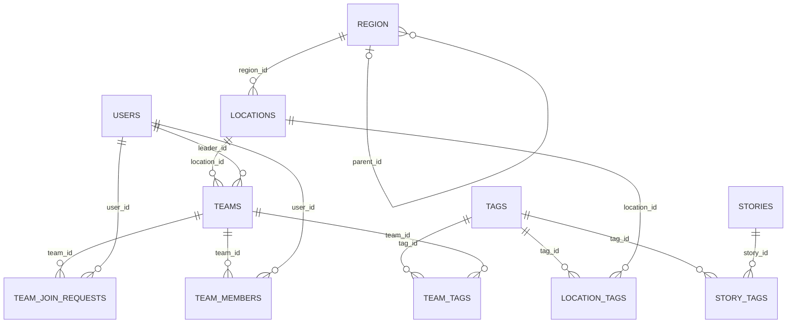
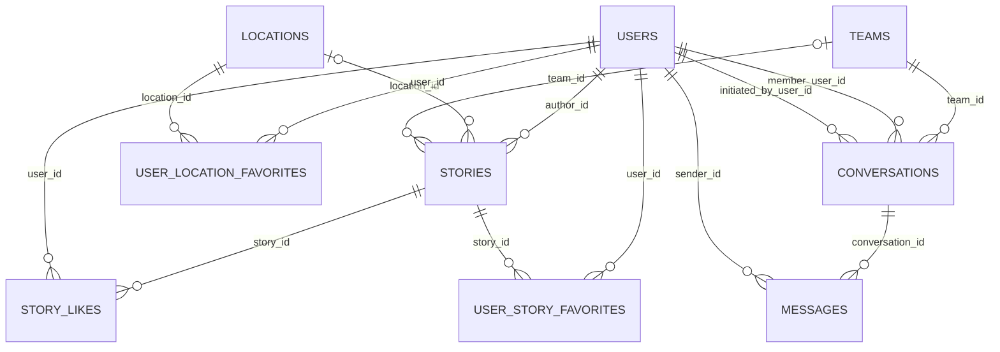

# GoMate 数据库最终设计 V2

> 设计状态：已落地。Drizzle schema、单一 baseline、最小 seed 与数据库合同测试均以本文为准；实现入口见 [`schema.ts`](../api/src/db/schema.ts)、[`0000_init.sql`](../api/db/migrations/0000_init.sql) 与[数据库测试](../api/scripts/database-v2-contract.test.mjs)。生产 binding 已指向 `gomate-db-v2`；后续生产变更遵守 [`prod-change-policy.md`](prod-change-policy.md)。

## 1. 设计目标

- 继续使用 Cloudflare D1（SQLite）和 Drizzle ORM。
- 不保留旧 schema 兼容层；所有环境使用同一份干净的 V2 baseline migration。
- 使用单一 `region` 表表达行政层级和产品开放城市，schema 原生支持多国家，但首批数据只初始化中国。
- 用户非核心资料默认收敛到 `users.extra` JSON；后续新增用户字段如无特殊说明也进入 `extra`。
- 尽量使用原生 FK、CHECK、UNIQUE 和复合主键，把触发器限制在真正的跨行/跨表派生规则。
- 消除 `entity_type + entity_id` 多态业务关系和数据库内的弱引用分析日志。
- D1 只保存结构化业务数据、图片 URL 和必要媒体元数据；图片内容、Base64 缓存不进入 D1。
- 索引围绕当前实际访问模式设计：城市活动、地点列表、故事流、成员列表和消息时间线。

## 2. 全局约定

| 项目         | 约定                                                                   |
| ------------ | ---------------------------------------------------------------------- |
| 主键         | `TEXT NOT NULL PRIMARY KEY`，由应用生成 NanoID                         |
| 时间         | `INTEGER` Unix 毫秒；创建时间默认 `(unixepoch() * 1000)`               |
| 布尔值       | `INTEGER NOT NULL CHECK (value IN (0, 1))`                             |
| JSON         | `TEXT`，必须附带 `CHECK (json_valid(column))`                          |
| 外键更新     | 默认 `ON UPDATE NO ACTION`                                             |
| 删除策略     | 业务主表优先 `RESTRICT` 或状态归档；纯关联表使用 `CASCADE`             |
| 命名         | 数据库使用 `snake_case`，Drizzle 属性使用 `camelCase`                  |
| `updated_at` | 数据库提供初始默认值；每次业务更新由应用显式刷新                       |
| 国家         | 保存 ISO 3166-1 alpha-2 `country_code`，暂不建立 `countries` 表        |
| 时区         | 保存 IANA timezone，例如 `Asia/Shanghai`；绑定开放服务的城市 Region    |
| 金额/距离    | 不使用模糊单位；字段名包含单位，例如 `distance_km`、`elevation_gain_m` |

所有 `country_code` 使用以下约束：

```sql
CHECK (
  length(country_code) = 2
  AND country_code = upper(country_code)
)
```

所有经纬度使用以下约束：

```sql
CHECK (latitude BETWEEN -90 AND 90)
CHECK (longitude BETWEEN -180 AND 180)
```

## 3. 表清单

V2 共 19 张 D1 表：

| 模块            | 表                                                                          |
| --------------- | --------------------------------------------------------------------------- |
| 用户与认证（4） | `users`、`sessions`、`accounts`、`verifications`                            |
| 地理（1）       | `region`                                                                    |
| 地点与标签（5） | `locations`、`tags`、`location_tags`、`team_tags`、`story_tags`             |
| 队伍（3）       | `teams`、`team_join_requests`、`team_members`                               |
| 内容与互动（4） | `stories`、`story_likes`、`user_location_favorites`、`user_story_favorites` |
| 私信（2）       | `conversations`、`messages`                                                 |

## 4. 总体关系图

### 4.1 地理、地点与活动



### 4.2 内容、互动与私信



## 5. 用户与认证

认证相关表遵循 Better Auth 核心字段要求；API Key 插件和 MCP 相关能力不进入 V2。

### 5.1 `users`

| 字段             | 类型                 | 空值 / 默认         | 约束与说明                                           |
| ---------------- | -------------------- | ------------------- | ---------------------------------------------------- |
| `id`             | TEXT                 | 非空                | PK                                                   |
| `name`           | TEXT                 | 非空                | Better Auth 用户名                                   |
| `nickname`       | TEXT                 | 可空                | 产品昵称                                             |
| `email`          | TEXT                 | 非空                | UQ；应用写入前统一转小写                             |
| `email_verified` | INTEGER boolean      | 非空，默认 `0`      | 邮箱验证状态                                         |
| `image`          | TEXT                 | 可空                | 头像 R2 key 或外部 URL                               |
| `bio`            | TEXT                 | 可空                | 个人简介                                             |
| `gender`         | TEXT                 | 可空                | CHECK：`male` / `female` / `other`                   |
| `birthday`       | INTEGER timestamp_ms | 可空                | 生日                                                 |
| `role`           | TEXT                 | 非空，默认 `user`   | CHECK：`user` / `admin`                              |
| `status`         | TEXT                 | 非空，默认 `active` | CHECK：`active` / `suspended` / `banned` / `deleted` |
| `extra`          | TEXT JSON            | 非空，默认 `{}`     | 用户扩展资料；CHECK 为合法 JSON object               |
| `created_at`     | INTEGER timestamp_ms | 非空，DB 当前时间   | 创建时间                                             |
| `updated_at`     | INTEGER timestamp_ms | 非空，DB 当前时间   | 更新时间                                             |
| `deleted_at`     | INTEGER timestamp_ms | 可空                | 软删除时间                                           |

索引：

- UQ `users_email_unique(email)`
- `users_status_created_idx(status, created_at, id)`

`extra` 的当前结构：

```json
{
  "level": "beginner",
  "completed_hikes": 0,
  "wechat": null,
  "city": null
}
```

约束与使用规则：

- `extra` 必须满足 `json_valid(extra)` 且 `json_type(extra) = 'object'`。
- `level`、`completed_hikes`、`wechat`、`city` 不再建立独立列；`city` 保存 `region.id`，但 JSON 内无法建立数据库 FK，由应用校验其指向开放的城市级 Region。
- 应用层维护版本化的 `UserExtra` 类型和默认值；更新单个属性时执行 JSON merge，不用不完整对象覆盖整个 `extra`。
- 后续新增用户资料字段如无特殊说明均进入 `extra`。只有明确需要数据库 FK、UNIQUE、索引、高频筛选或安全边界的字段，经过单独设计后才提升为独立列。
- `completed_hikes` 是可重算缓存，必须保持非负；需要纠正时根据已完成队伍和有效成员记录重算。

### 5.2 `sessions`

| 字段         | 类型                 | 空值 / 默认       | 约束与说明               |
| ------------ | -------------------- | ----------------- | ------------------------ |
| `id`         | TEXT                 | 非空              | PK                       |
| `user_id`    | TEXT                 | 非空              | FK → `users.id`，CASCADE |
| `token`      | TEXT                 | 非空              | UQ                       |
| `expires_at` | INTEGER timestamp_ms | 非空              | 会话过期时间             |
| `ip_address` | TEXT                 | 可空              | 客户端 IP                |
| `user_agent` | TEXT                 | 可空              | User-Agent               |
| `created_at` | INTEGER timestamp_ms | 非空，DB 当前时间 | 创建时间                 |
| `updated_at` | INTEGER timestamp_ms | 非空，DB 当前时间 | 更新时间                 |

索引：UQ `sessions_token_unique(token)`；普通索引 `sessions_user_idx(user_id)`、`sessions_expires_idx(expires_at)`。

### 5.3 `accounts`

| 字段                       | 类型                 | 空值 / 默认       | 约束与说明               |
| -------------------------- | -------------------- | ----------------- | ------------------------ |
| `id`                       | TEXT                 | 非空              | PK                       |
| `user_id`                  | TEXT                 | 非空              | FK → `users.id`，CASCADE |
| `account_id`               | TEXT                 | 非空              | Provider 侧账号 ID       |
| `provider_id`              | TEXT                 | 非空              | Provider ID              |
| `access_token`             | TEXT                 | 可空              | Access token             |
| `refresh_token`            | TEXT                 | 可空              | Refresh token            |
| `access_token_expires_at`  | INTEGER timestamp_ms | 可空              | Access token 过期时间    |
| `refresh_token_expires_at` | INTEGER timestamp_ms | 可空              | Refresh token 过期时间   |
| `scope`                    | TEXT                 | 可空              | OAuth scope              |
| `id_token`                 | TEXT                 | 可空              | OIDC ID token            |
| `password`                 | TEXT                 | 可空              | 密码凭证字段             |
| `expires_at`               | INTEGER timestamp_ms | 可空              | 通用过期时间             |
| `created_at`               | INTEGER timestamp_ms | 非空，DB 当前时间 | 创建时间                 |
| `updated_at`               | INTEGER timestamp_ms | 非空，DB 当前时间 | 更新时间                 |

索引：UQ `accounts_provider_unique(provider_id, account_id)`；普通索引 `accounts_user_idx(user_id)`。

### 5.4 `verifications`

| 字段         | 类型                 | 空值 / 默认       | 约束与说明   |
| ------------ | -------------------- | ----------------- | ------------ |
| `id`         | TEXT                 | 非空              | PK           |
| `identifier` | TEXT                 | 非空              | 验证目标标识 |
| `value`      | TEXT                 | 非空              | 验证值       |
| `expires_at` | INTEGER timestamp_ms | 非空              | 过期时间     |
| `created_at` | INTEGER timestamp_ms | 非空，DB 当前时间 | 创建时间     |
| `updated_at` | INTEGER timestamp_ms | 非空，DB 当前时间 | 更新时间     |

索引：UQ `verifications_identifier_unique(identifier)`；普通索引 `verifications_expires_idx(expires_at)`。

## 6. 地理模型

### 6.1 `region`

一张表同时表达行政层级和产品开放城市。当前业务实体只引用 `service_enabled = 1` 的城市级 Region；省、区县层级用于组织选择器和未来扩展，不单独建立映射表。

| 字段               | 类型                 | 空值 / 默认       | 约束与说明                                        |
| ------------------ | -------------------- | ----------------- | ------------------------------------------------- |
| `id`               | TEXT                 | 非空              | PK，内部 ID，不使用行政编码充当主键               |
| `country_code`     | TEXT                 | 非空              | ISO alpha-2；使用全局 country code CHECK          |
| `parent_id`        | TEXT                 | 可空              | 自引用 FK → `region.id`，RESTRICT                 |
| `name`             | TEXT                 | 非空              | 产品默认语言名称                                  |
| `name_en`          | TEXT                 | 可空              | 英文名称                                          |
| `slug`             | TEXT                 | 非空              | 稳定 URL 标识；同一国家内唯一                     |
| `code`             | TEXT                 | 可空              | 当前采用的一套行政区划代码；同一国家内唯一        |
| `level`            | TEXT                 | 非空              | CHECK：`province` / `city` / `district` / `other` |
| `timezone`         | TEXT                 | 可空              | IANA timezone；开放服务的城市必须填写             |
| `center_latitude`  | REAL                 | 可空              | 地图中心纬度；开放服务的城市必须填写              |
| `center_longitude` | REAL                 | 可空              | 地图中心经度；开放服务的城市必须填写              |
| `service_enabled`  | INTEGER boolean      | 非空，默认 `0`    | 是否可被用户、地点和队伍选择                      |
| `is_hot`           | INTEGER boolean      | 非空，默认 `0`    | 是否在城市选择器标为热门                          |
| `sort_order`       | INTEGER              | 非空，默认 `0`    | 同层级及城市选择器排序                            |
| `created_at`       | INTEGER timestamp_ms | 非空，DB 当前时间 | 创建时间                                          |
| `updated_at`       | INTEGER timestamp_ms | 非空，DB 当前时间 | 更新时间                                          |

约束与索引：

- `region_parent_not_self_check(id <> parent_id)`
- UQ `region_country_slug_unique(country_code, slug)`
- 部分 UQ `region_country_code_unique(country_code, code) WHERE code IS NOT NULL`
- `region_hierarchy_idx(country_code, parent_id, level, sort_order)`
- `region_service_picker_idx(country_code, service_enabled, is_hot, sort_order, id)`
- `region_service_shape_check`：`service_enabled = 1` 时必须满足 `level = 'city'`，且 `timezone`、地图中心坐标均非空。
- 经纬度使用全局范围 CHECK；应用写入时检测父子 Region 属于同一国家并禁止祖先链循环。

单一 `code` 只表示当前产品采用的行政编码。以后明确需要同时维护多套供应商编码或历史编码时，再独立增加 `region_codes`，不在 V2 提前建表。

## 7. 地点与标签

### 7.1 `locations`

可组织队伍活动的实体地点。地点只描述“在哪里”及其固有信息，不保存实际活动类型；同一地点可以承载不同类型的队伍活动。`region_id` 指向已开放服务的城市级 Region。

| 字段                       | 类型                 | 空值 / 默认            | 约束与说明                                              |
| -------------------------- | -------------------- | ---------------------- | ------------------------------------------------------- |
| `id`                       | TEXT                 | 非空                   | PK                                                      |
| `region_id`                | TEXT                 | 非空                   | FK → `region.id`，RESTRICT；必须是开放服务的城市 Region |
| `name`                     | TEXT                 | 非空                   | 地点名                                                  |
| `slug`                     | TEXT                 | 非空                   | 城市内 URL 标识                                         |
| `supported_activity_types` | TEXT JSON            | 非空，默认 `[]`        | 地点支持的活动类型数组                                  |
| `status`                   | TEXT                 | 非空，默认 `published` | CHECK：`draft` / `published` / `archived`               |
| `subtitle`                 | TEXT                 | 可空                   | 副标题                                                  |
| `description`              | TEXT                 | 非空                   | 详情描述                                                |
| `address`                  | TEXT                 | 可空                   | 地址文本                                                |
| `latitude`                 | REAL                 | 非空                   | 纬度，范围 CHECK                                        |
| `longitude`                | REAL                 | 非空                   | 经度，范围 CHECK                                        |
| `cover_image_url`          | TEXT                 | 非空                   | 公开图片链接；应用校验为允许域名下的 HTTPS URL          |
| `images`                   | TEXT JSON            | 非空，默认 `[]`        | 其他公开图片链接数组                                    |
| `extra`                    | TEXT JSON            | 非空，默认 `{}`        | 地点扩展资料，例如存在徒步路线时保存 `extra.hiking`     |
| `created_by_user_id`       | TEXT                 | 可空                   | FK → `users.id`，`ON DELETE SET NULL`；seed 可为空      |
| `created_at`               | INTEGER timestamp_ms | 非空，DB 当前时间      | 创建时间                                                |
| `updated_at`               | INTEGER timestamp_ms | 非空，DB 当前时间      | 更新时间                                                |

约束与索引：

- UQ `locations_region_slug_unique(region_id, slug)`
- `locations_region_feed_idx(region_id, status, created_at, id)`
- 应用写入时校验 `region_id` 对应 `service_enabled = 1` 且 `level = 'city'`。
- 数据库 CHECK 保证 `supported_activity_types` 是合法 JSON array；应用校验元素只允许 `hiking` / `explore` / `leisure` / `travel` 且不能重复。
- `locations_published_activity_check`：`status = 'published'` 时 `json_array_length(supported_activity_types) > 0`。
- `images` 必须是合法 JSON 字符串数组，`extra` 必须是合法 JSON object；图片数组中的每一项由应用校验为允许域名下的 HTTPS URL。

`extra.hiking` 的推荐结构：

```json
{
  "hiking": {
    "difficulty": "moderate",
    "duration_min": 120,
    "duration_max": 180,
    "distance_km": 5.5,
    "elevation_gain_m": 700,
    "best_seasons": ["spring", "autumn"],
    "gear_essential": [],
    "gear_optional": [],
    "overview": null,
    "tips": [],
    "warnings": []
  }
}
```

`extra.hiking` 表示地点本身具备的徒步路线信息，不代表某支队伍的活动类型。如果某个属性以后需要高频数据库筛选、排序或索引，再提升为 `locations` 的独立列。

### 7.2 `tags`

共享标签词典。标签不再持有 `type`，使用范围由实际关联表决定，同一标签可以用于地点、队伍和故事。

| 字段         | 类型                 | 空值 / 默认       | 约束与说明     |
| ------------ | -------------------- | ----------------- | -------------- |
| `id`         | TEXT                 | 非空              | PK             |
| `name`       | TEXT                 | 非空              | 展示名称       |
| `slug`       | TEXT                 | 非空              | 规范化唯一标识 |
| `created_at` | INTEGER timestamp_ms | 非空，DB 当前时间 | 创建时间       |

索引：UQ `tags_slug_unique(slug)`；如需要中文模糊搜索，后续建立 FTS5 虚拟表，不使用 `%keyword%` 依赖 B-tree。

### 7.3 `location_tags`

| 字段          | 类型                 | 空值 / 默认       | 约束与说明                            |
| ------------- | -------------------- | ----------------- | ------------------------------------- |
| `location_id` | TEXT                 | 非空              | 复合 PK；FK → `locations.id`，CASCADE |
| `tag_id`      | TEXT                 | 非空              | 复合 PK；FK → `tags.id`，CASCADE      |
| `created_at`  | INTEGER timestamp_ms | 非空，DB 当前时间 | 创建时间                              |

主键：`(location_id, tag_id)`；反向索引 `location_tags_tag_idx(tag_id, location_id)`。

### 7.4 `team_tags`

| 字段         | 类型                 | 空值 / 默认       | 约束与说明                        |
| ------------ | -------------------- | ----------------- | --------------------------------- |
| `team_id`    | TEXT                 | 非空              | 复合 PK；FK → `teams.id`，CASCADE |
| `tag_id`     | TEXT                 | 非空              | 复合 PK；FK → `tags.id`，CASCADE  |
| `created_at` | INTEGER timestamp_ms | 非空，DB 当前时间 | 创建时间                          |

主键：`(team_id, tag_id)`；反向索引 `team_tags_tag_idx(tag_id, team_id)`。

### 7.5 `story_tags`

| 字段         | 类型                 | 空值 / 默认       | 约束与说明                          |
| ------------ | -------------------- | ----------------- | ----------------------------------- |
| `story_id`   | TEXT                 | 非空              | 复合 PK；FK → `stories.id`，CASCADE |
| `tag_id`     | TEXT                 | 非空              | 复合 PK；FK → `tags.id`，CASCADE    |
| `created_at` | INTEGER timestamp_ms | 非空，DB 当前时间 | 创建时间                            |

主键：`(story_id, tag_id)`；反向索引 `story_tags_tag_idx(tag_id, story_id)`。

## 8. 队伍

### 8.1 状态模型

队伍生命周期由时间戳和成行/取消动作计算，招募开关和容量独立保存：

| 概念       | 计算 / 存储方式                                                 |
| ---------- | --------------------------------------------------------------- |
| 已取消     | `cancelled_at IS NOT NULL`                                      |
| 待成行     | 未取消、`formed_at IS NULL` 且 `start_at > now`                 |
| 已成行     | 未取消、`formed_at IS NOT NULL` 且 `start_at > now`             |
| 正在进行   | 未取消、已成行且 `start_at <= now < end_at`                     |
| 已完成     | 未取消、已成行且 `end_at <= now`                                |
| 过期未成行 | 未取消、`formed_at IS NULL` 且 `start_at <= now`                |
| 招募状态   | `recruitment_status`：`open` / `closed`                         |
| 已满员     | 不存储；`active_member_count >= max_participants` 时计算为 true |

状态计算时“已取消”优先级最高。有效招募中还必须同时满足：`recruitment_status = 'open'`、未取消、`start_at > now` 且未满员。

### 8.2 `teams`

实际活动类型属于队伍，因为同一地点可以承载不同活动。城市通过 `teams.location_id → locations.region_id` 获取，不在队伍中重复保存。

| 字段                 | 类型                 | 空值 / 默认       | 约束与说明                                         |
| -------------------- | -------------------- | ----------------- | -------------------------------------------------- |
| `id`                 | TEXT                 | 非空              | PK                                                 |
| `location_id`        | TEXT                 | 非空              | FK → `locations.id`，RESTRICT                      |
| `leader_id`          | TEXT                 | 非空              | FK → `users.id`，RESTRICT                          |
| `activity_type`      | TEXT                 | 非空              | CHECK：`hiking` / `explore` / `leisure` / `travel` |
| `title`              | TEXT                 | 非空              | 队伍标题                                           |
| `description`        | TEXT                 | 可空              | 描述                                               |
| `start_at`           | INTEGER timestamp_ms | 非空              | 开始时间                                           |
| `end_at`             | INTEGER timestamp_ms | 非空              | 结束时间，CHECK `>= start_at`                      |
| `max_participants`   | INTEGER              | 非空，默认 `9`    | 不含队长；CHECK `1..49`                            |
| `requirements`       | TEXT JSON            | 非空，默认 `[]`   | 报名要求字符串数组；CHECK 为合法 JSON array        |
| `recruitment_status` | TEXT                 | 非空，默认 `open` | CHECK：`open` / `closed`                           |
| `formed_at`          | INTEGER timestamp_ms | 可空              | 队长确认成行时间                                   |
| `cancelled_at`       | INTEGER timestamp_ms | 可空              | 取消时间；非空表示已取消                           |
| `checklist`          | TEXT JSON            | 可空              | `TeamChecklist` 聚合；CHECK `NULL OR json_valid()` |
| `created_at`         | INTEGER timestamp_ms | 非空，DB 当前时间 | 创建时间                                           |
| `updated_at`         | INTEGER timestamp_ms | 非空，DB 当前时间 | 更新时间                                           |

约束与索引：

- `teams_time_range_check(end_at >= start_at)`
- `teams_capacity_check(max_participants BETWEEN 1 AND 49)`
- `teams_location_start_idx(location_id, start_at, id)`
- `teams_location_activity_feed_idx(location_id, activity_type, recruitment_status, start_at, id)`
- `teams_leader_created_idx(leader_id, created_at, id)`
- `teams_end_idx(cancelled_at, end_at, id)`，供完成态和过期态查询
- `requirements` 必须是合法 JSON 字符串数组，数组元素由应用校验为非空文本。
- 创建队伍或修改 `activity_type/location_id` 时，应用事务必须验证 `activity_type` 存在于地点的 `supported_activity_types`。
- 修改地点支持列表时，不得移除仍被尚未开始且未取消的队伍使用的活动类型；该规则由服务层事务和测试保证。

展示图标由前端根据 `activity_type` 映射，不进入数据库。不再保存 `duration_min`，由 `end_at - start_at` 计算；也不运行定时任务回写完成状态。

### 8.3 `team_join_requests`

申请工作流与正式成员分离；`approved` 申请只记录决策历史，正式关系写入 `team_members`。

| 字段                 | 类型                 | 空值 / 默认          | 约束与说明                                               |
| -------------------- | -------------------- | -------------------- | -------------------------------------------------------- |
| `id`                 | TEXT                 | 非空                 | PK                                                       |
| `team_id`            | TEXT                 | 非空                 | FK → `teams.id`，CASCADE                                 |
| `user_id`            | TEXT                 | 非空                 | FK → `users.id`，CASCADE                                 |
| `status`             | TEXT                 | 非空，默认 `pending` | CHECK：`pending` / `approved` / `rejected` / `cancelled` |
| `message`            | TEXT                 | 可空                 | 申请说明                                                 |
| `decided_by_user_id` | TEXT                 | 可空                 | FK → `users.id`，SET NULL                                |
| `decided_at`         | INTEGER timestamp_ms | 可空                 | 审批时间                                                 |
| `created_at`         | INTEGER timestamp_ms | 非空，DB 当前时间    | 创建时间                                                 |
| `updated_at`         | INTEGER timestamp_ms | 非空，DB 当前时间    | 更新时间                                                 |

索引与约束：

- 部分 UQ `team_join_requests_one_pending_unique(team_id, user_id) WHERE status = 'pending'`
- `team_join_requests_team_status_idx(team_id, status, created_at, id)`
- `team_join_requests_user_created_idx(user_id, created_at, id)`
- `status = 'pending'` 时 `decided_at`、`decided_by_user_id` 必须为空；已审批时二者必须有值，`cancelled` 可由申请人取消而不要求决定人。

### 8.4 `team_members`

只保存已经加入的参与者；队长由 `teams.leader_id` 表达，不重复写入成员表。

| 字段        | 类型                 | 空值 / 默认         | 约束与说明                                       |
| ----------- | -------------------- | ------------------- | ------------------------------------------------ |
| `team_id`   | TEXT                 | 非空                | 复合 PK；FK → `teams.id`，CASCADE                |
| `user_id`   | TEXT                 | 非空                | 复合 PK；FK → `users.id`，CASCADE                |
| `role`      | TEXT                 | 非空，默认 `member` | CHECK：`member` / `co_leader`                    |
| `joined_at` | INTEGER timestamp_ms | 非空，DB 当前时间   | 最近加入时间                                     |
| `left_at`   | INTEGER timestamp_ms | 可空                | 非空表示已退出；重新加入时清空并刷新 `joined_at` |

主键：`(team_id, user_id)`。索引：

- `team_members_active_idx(team_id, left_at, joined_at, user_id)`
- `team_members_user_idx(user_id, left_at, joined_at, team_id)`

成员插入或把 `left_at` 从非空改为空前，由容量触发器检查活动成员数小于 `max_participants`。队长不能成为自己队伍的 participant，由应用和测试保证。

## 9. 内容与互动

### 9.1 `stories`

统一承载公开长内容和队伍活动后的短分享。`team_id IS NOT NULL` 表示队伍活动回顾；普通 Story 不关联队伍。

| 字段          | 类型                 | 空值 / 默认            | 约束与说明                                      |
| ------------- | -------------------- | ---------------------- | ----------------------------------------------- |
| `id`          | TEXT                 | 非空                   | PK                                              |
| `author_id`   | TEXT                 | 非空                   | FK → `users.id`，CASCADE                        |
| `team_id`     | TEXT                 | 可空                   | FK → `teams.id`，RESTRICT；非空表示队伍活动回顾 |
| `location_id` | TEXT                 | 可空                   | FK → `locations.id`，SET NULL                   |
| `title`       | TEXT                 | 可空                   | 普通 Story 必填；队伍活动回顾可空               |
| `summary`     | TEXT                 | 可空                   | 列表摘要                                        |
| `content`     | TEXT                 | 非空                   | 正文；CHECK 去除首尾空格后非空                  |
| `images`      | TEXT JSON            | 非空，默认 `[]`        | 公开图片 URL 字符串数组；首图作为列表封面       |
| `status`      | TEXT                 | 非空，默认 `published` | CHECK：`draft` / `published` / `hidden`         |
| `view_count`  | INTEGER              | 非空，默认 `0`         | CHECK `>= 0`；允许异步聚合                      |
| `like_count`  | INTEGER              | 非空，默认 `0`         | CHECK `>= 0`；由数据库触发器维护                |
| `created_at`  | INTEGER timestamp_ms | 非空，DB 当前时间      | 创建时间                                        |
| `updated_at`  | INTEGER timestamp_ms | 非空，DB 当前时间      | 更新时间                                        |

索引：

- `stories_feed_idx(status, created_at, id)`
- `stories_author_idx(author_id, created_at, id)`
- `stories_team_feed_idx(team_id, status, created_at, id)`
- `stories_location_feed_idx(location_id, status, created_at, id)`

- `images` 必须是合法 JSON 字符串数组；应用校验数量上限、去重及受控域名下的 HTTPS URL。
- 普通 Story 要求 `title` 去除首尾空格后非空；队伍活动回顾允许不填标题，列表标题可由队伍名称或正文摘要生成。
- 创建队伍活动回顾时，队伍必须已成行、未取消且 `end_at <= now`，作者必须是队长或活动成员。
- 队伍活动回顾的 `location_id` 必须等于 `teams.location_id`，由服务层事务和测试保证。

`like_count` 是有意保留的读模型；真实关系仍以 `story_likes` 为准，可随时重算。原地点“近期活动”列表和本地圈活跃信号统一查询已发布、带 `team_id` 的 Story。

### 9.2 `story_likes`

| 字段         | 类型                 | 空值 / 默认       | 约束与说明                          |
| ------------ | -------------------- | ----------------- | ----------------------------------- |
| `user_id`    | TEXT                 | 非空              | 复合 PK；FK → `users.id`，CASCADE   |
| `story_id`   | TEXT                 | 非空              | 复合 PK；FK → `stories.id`，CASCADE |
| `created_at` | INTEGER timestamp_ms | 非空，DB 当前时间 | 点赞时间                            |

主键：`(user_id, story_id)`；反向索引 `story_likes_story_idx(story_id, created_at, user_id)`。插入和删除后由触发器增减 `stories.like_count`。

### 9.3 `user_location_favorites`

| 字段          | 类型                 | 空值 / 默认       | 约束与说明                            |
| ------------- | -------------------- | ----------------- | ------------------------------------- |
| `user_id`     | TEXT                 | 非空              | 复合 PK；FK → `users.id`，CASCADE     |
| `location_id` | TEXT                 | 非空              | 复合 PK；FK → `locations.id`，CASCADE |
| `created_at`  | INTEGER timestamp_ms | 非空，DB 当前时间 | 收藏时间                              |

主键：`(user_id, location_id)`。索引：

- `user_location_favorites_user_idx(user_id, created_at, location_id)`
- `user_location_favorites_location_idx(location_id, created_at, user_id)`

### 9.4 `user_story_favorites`

| 字段         | 类型                 | 空值 / 默认       | 约束与说明                          |
| ------------ | -------------------- | ----------------- | ----------------------------------- |
| `user_id`    | TEXT                 | 非空              | 复合 PK；FK → `users.id`，CASCADE   |
| `story_id`   | TEXT                 | 非空              | 复合 PK；FK → `stories.id`，CASCADE |
| `created_at` | INTEGER timestamp_ms | 非空，DB 当前时间 | 收藏时间                            |

主键：`(user_id, story_id)`。索引：

- `user_story_favorites_user_idx(user_id, created_at, story_id)`
- `user_story_favorites_story_idx(story_id, created_at, user_id)`

## 10. 私信

V2 只支持“一个队伍的队长与一名队员之间的双人会话”。暂不引入通用群聊参与者模型，以减少权限和未读状态复杂度。

### 10.1 `conversations`

| 字段                   | 类型                 | 空值 / 默认       | 约束与说明                             |
| ---------------------- | -------------------- | ----------------- | -------------------------------------- |
| `id`                   | TEXT                 | 非空              | PK                                     |
| `team_id`              | TEXT                 | 非空              | FK → `teams.id`，CASCADE               |
| `member_user_id`       | TEXT                 | 非空              | FK → `users.id`，CASCADE；对话中的队员 |
| `initiated_by_user_id` | TEXT                 | 非空              | FK → `users.id`，RESTRICT；首次发起人  |
| `last_message_preview` | TEXT                 | 可空              | 最近消息截断摘要，由触发器维护         |
| `last_message_at`      | INTEGER timestamp_ms | 可空              | 最近消息时间，由触发器维护             |
| `created_at`           | INTEGER timestamp_ms | 非空，DB 当前时间 | 创建时间                               |
| `updated_at`           | INTEGER timestamp_ms | 非空，DB 当前时间 | 更新时间                               |

约束与索引：

- UQ `(team_id, member_user_id)`
- `conversations_member_inbox_idx(member_user_id, last_message_at, id)`
- `conversations_team_inbox_idx(team_id, last_message_at, id)`

队长不重复保存在会话中，而是读取 `teams.leader_id`。这样转让队长后权限自然转移；会话创建时要求 `member_user_id` 是活动成员，`initiated_by_user_id` 是该成员或当前队长，由应用事务保证。

### 10.2 `messages`

| 字段              | 类型                 | 空值 / 默认       | 约束与说明                         |
| ----------------- | -------------------- | ----------------- | ---------------------------------- |
| `id`              | TEXT                 | 非空              | PK                                 |
| `conversation_id` | TEXT                 | 非空              | FK → `conversations.id`，CASCADE   |
| `sender_id`       | TEXT                 | 非空              | FK → `users.id`，RESTRICT          |
| `content`         | TEXT                 | 非空              | 消息正文；CHECK 去除首尾空格后非空 |
| `read_at`         | INTEGER timestamp_ms | 可空              | 对方首次读到的时间；空表示未读     |
| `created_at`      | INTEGER timestamp_ms | 非空，DB 当前时间 | 发送时间                           |

索引：

- `messages_conversation_cursor_idx(conversation_id, created_at, id)`
- `messages_sender_idx(sender_id, created_at, id)`

发送者必须是会话队员或当前队长，由 API 授权保证。V2 不保存 `is_read` 布尔值；`read_at` 同时表达状态和时间。消息翻页游标使用 `(created_at, id)`。

## 11. 数据库触发器

触发器只用于单靠声明式约束无法可靠保证、且并发写入时必须原子成立的规则。最终保留 8 个：

| 触发器                                      | 时机                                        | 作用                                 |
| ------------------------------------------- | ------------------------------------------- | ------------------------------------ |
| `sessions_active_user_insert_guard`         | `sessions` BEFORE INSERT                    | 禁止为非 active/已删除用户创建会话   |
| `users_auth_revoke_after_inactive`          | `users` AFTER UPDATE OF `status,deleted_at` | 撤销全部会话和未消费的密码重置凭证   |
| `team_members_capacity_validate_insert`     | `team_members` BEFORE INSERT                | 阻止活动成员超过容量                 |
| `team_members_capacity_validate_reactivate` | `team_members` BEFORE UPDATE OF `left_at`   | 重新加入前检查容量                   |
| `teams_capacity_validate_update`            | `teams` BEFORE UPDATE OF `max_participants` | 阻止容量被调低到当前活动人数以下     |
| `story_likes_count_after_insert`            | `story_likes` AFTER INSERT                  | 原子增加故事点赞数                   |
| `story_likes_count_after_delete`            | `story_likes` AFTER DELETE                  | 原子减少故事点赞数且不低于零         |
| `messages_summary_after_insert`             | `messages` AFTER INSERT                     | 更新会话摘要、最近消息时间和更新时间 |

点赞创建与消息插入若未能更新对应的 Story/Conversation，会分别 `RAISE(ABORT, 'STORY_LIKE_COUNT_FAILED')` 和 `RAISE(ABORT, 'MESSAGE_SUMMARY_FAILED')`；API 只返回稳定错误 envelope，不回传 D1/SQL 诊断。点赞删除触发器保留 `ON DELETE CASCADE` 语义：父 Story 级联删除时父行已不可见，因此不把该合法的零行更新误判为失败。

用户从 active 变为 suspended/banned/deleted，或 `deleted_at` 变为非空时，数据库在同一条 UPDATE 内删除该用户全部 `sessions` 和 `password-reset:<userId>` challenge。之后即使恢复 active 或清空 `deleted_at`，旧会话与重置凭证也不会复活。`sessions_active_user_insert_guard` 还会在 session INSERT 的同一语句内复核用户状态，关闭认证层 active 预查与会话落库之间的竞态；密码重置的签发与消费语句同样在提交时复核 active/non-deleted。

其余规则优先使用 PK、FK、UQ、CHECK 和部分索引。跨表身份权限、工作流状态迁移和“成员必须属于队伍”等规则由单事务的服务层命令与测试保证。

## 12. D1、R2、KV 的边界

| 存储              | 保存内容                                                 | 不保存内容                              |
| ----------------- | -------------------------------------------------------- | --------------------------------------- |
| D1                | 用户、地区、地点、队伍、内容、关系和受控域名下的媒体 URL | 图片二进制、Base64 海报缓存、大响应缓存 |
| R2                | 地点图片、Story 图片、需要长期保留的生成图片             | 可查询业务关系                          |
| `CACHE_KV`        | 有 TTL 的分享海报 Base64、限流纵深和可重建缓存           | session、永久业务数据、关系真实性来源   |
| Cache API（可选） | HTTP GET 响应缓存                                        | 用户私有数据、写模型                    |

媒体写入采用“先上传临时 key，上传成功后再提交 D1；失败时异步清理”的补偿流程。地点和 Story 图片保存最终公开 URL。图片域名变更时需要批量回填 URL，因此只允许写入受控 CDN/R2 域名，禁止保存会过期的签名 URL。

认证会话保存在 D1 `sessions`，不得复制到 `CACHE_KV`。分享海报缓存使用内容哈希 key 和明确的 `expirationTtl`，不创建数据库缓存表。

## 13. 查询与索引原则

- 所有时间线使用 keyset pagination，游标至少包含 `(时间字段, id)`；不使用大偏移量 `OFFSET`。
- 索引列顺序遵循“等值过滤 → 范围/排序 → 稳定 ID”，每条关键 API 查询应有对应的 `EXPLAIN QUERY PLAN` 测试。
- 复合索引不重复创建可由其左前缀覆盖的单列索引。
- 首页队伍查询通过 `teams.location_id → locations.region_id` 按城市过滤，需要活动筛选时追加 `teams.activity_type`。
- 地点支持类型筛选使用 `json_each(locations.supported_activity_types)`；当前数据规模不增加关联表，确认成为热点后再拆分。
- 标签筛选从各自的专用关联表进入，避免多态 `entity_type + entity_id` 带来的弱引用。
- 全文搜索在数据量和产品需求明确后再增加 D1 FTS5 虚表；V2 基线不预建无法验证收益的搜索索引。
- 计数缓存只保留已证明是热点的 `stories.like_count`；其他统计优先实时聚合或在观测到瓶颈后增加读模型。

## 14. 关键不变量

以下规则必须同时出现在实现测试中：

1. 地点引用的 Region 必须满足 `service_enabled = 1` 且 `level = 'city'`；`users.extra.city` 非空时由应用执行相同校验。
2. 队伍城市始终通过地点获得；Region 父子节点必须属于同一国家且不能形成循环。
3. 每支队伍的 `activity_type` 必须包含在对应地点的 `supported_activity_types` 中。
4. 队长不占 `max_participants`；活动 participant 数不得超过容量。
5. 同一用户对同一队伍最多有一个 `pending` 申请。
6. 批准申请时，在同一事务中写入或重新激活 `team_members`，并完成申请决策。
7. 队伍活动回顾作者、会话队员和消息发送者必须满足对应成员权限。
8. 每个队伍与队员组合最多一个会话。
9. `stories.like_count` 必须等于 `story_likes` 的实际行数。
10. 收藏和标签关系删除后不能留下悬空记录。
11. R2 对象与 D1 媒体元数据失败时必须可补偿清理。
12. 用户变为非 active 或被软删除时，全部会话与未消费的密码重置 challenge 必须在同一更新中撤销；非 active 用户不得新建会话、签发或消费重置凭证，恢复用户不得恢复旧能力。

## 15. 落地实现与验证

当前实现不包含旧表兼容层或双写：

1. [`api/src/db/schema.ts`](../api/src/db/schema.ts) 是 Drizzle V2 schema。
2. [`api/db/migrations/0000_init.sql`](../api/db/migrations/0000_init.sql) 是唯一 baseline；[`api/db/seed.sql`](../api/db/seed.sql) 是可幂等最小 seed。
3. [`database-v2-contract.test.mjs`](../api/scripts/database-v2-contract.test.mjs) 完整核对列/type/null/default/PK、FK action、CHECK、索引列序/unique/partial predicate 与 8 个 trigger；[`check-migrations-sync.mjs`](../api/scripts/check-migrations-sync.mjs) 在常规检查中执行同一套 Drizzle/baseline 语义 parity。
4. [`database-integrity.test.mjs`](../api/scripts/database-integrity.test.mjs) 使用真实 SQLite 验证声明式约束、触发器、级联、会话撤销和查询计划；[`database-workerd-replay.test.mjs`](../api/scripts/database-workerd-replay.test.mjs) 使用真实本地 workerd/D1 binding 验证迁移重放、会话不可复活、稳定错误 envelope、审批 batch 回滚/重试与并发最后席位。
5. 生产 D1、binding、migration 或恢复操作属于独立生产变更；异常时保持写保护并使用 D1 Time Travel/备份或经批准的新 V2 数据库，不得恢复已退役的旧 binding。

本文档、Drizzle schema 与 baseline 必须同步修改；语义 parity 检查不通过时不得合并。
