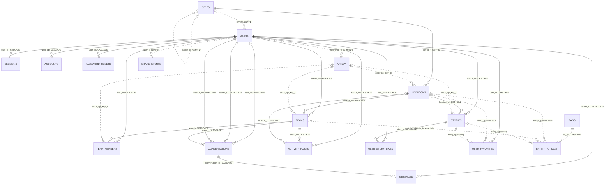
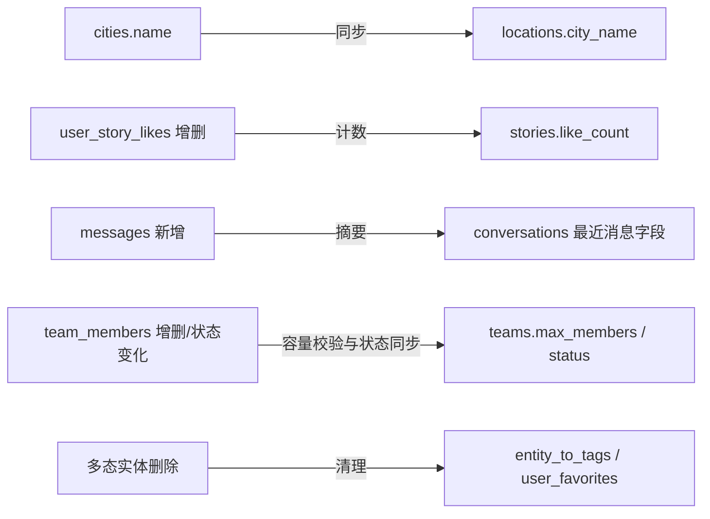

# GoMate 数据库定义与关系

> 仓库结构快照：2026-08-16。本文描述的是仓库中全部 migration 从空库重放后的**期望结构**，不是对线上 D1 的实时探测结果。

## 1. 数据库基线

- 数据库：Cloudflare D1（SQLite 方言）。
- ORM：Drizzle ORM；入口为 `api/src/db/index.ts`，模型为 `api/src/db/schema.ts`。
- D1 binding：`DB`；数据库名 `gomate-db`；migration 目录 `api/db/migrations/`。
- 当前 migration：28 个 SQL 文件，对应 `meta/_journal.json` 中 28 条记录。
- 当前存活表：20 张；完整性触发器：32 个。
- 已删除模型：`pois`、`entity_to_pois`（`0012_drop_pois.sql`）和 `routes`（`0013_drop_routes.sql`）。它们不属于当前结构。

结构来源按以下优先级理解：

1. 全量 migration 重放结果：数据库真实列、原生外键、索引、CHECK 和触发器。
2. `api/src/db/schema.ts`：Drizzle 字段映射、应用侧默认值和 TypeScript 类型语义。
3. 路由与服务：没有数据库约束时的业务约定。

## 2. 阅读约定

| 标记           | 含义                                                |
| -------------- | --------------------------------------------------- |
| PK             | 主键                                                |
| FK             | SQLite 原生外键                                     |
| UQ             | 唯一约束或唯一索引                                  |
| 逻辑关联       | 没有原生 FK，由触发器或应用代码维护                 |
| `timestamp_ms` | 以 `INTEGER` 存储的 Unix 毫秒时间戳                 |
| `boolean`      | 以 `INTEGER` 的 `0/1` 存储                          |
| JSON 文本      | SQLite `TEXT`；部分字段由 `json_valid()` 触发器校验 |

多数 `created_at` / `updated_at` 没有数据库默认值，而是由 Drizzle 的 `$defaultFn(() => new Date())` 在应用写入时补齐。下文写作“Drizzle 当前时间”的字段依赖应用侧默认值；写作“DB 当前时间”的字段由 SQLite 默认表达式生成。

SQLite 普通 rowid 表有一项历史兼容行为：仅写成 `TEXT PRIMARY KEY` 而未显式声明 `NOT NULL` 时，底层仍可能接受 `NULL`。当前 `stories.id` 与 `share_events.id` 的 migration DDL 属于这种情况；Drizzle 模型仍把二者视为必填主键。表格会单独标出这项差异。

## 3. 总体关系图

实线表示 SQLite 原生 FK；虚线表示触发器维护或仅由应用约定的逻辑关联。多态关联的每一行只会指向标签所示类型中的一种。



未连入主图的 `VERIFICATIONS`、`IMAGE_CACHES` 是独立表。`SHARE_EVENTS.entity_type/entity_id` 是未被数据库验证的多态引用，因此不画成到具体实体的确定关系。

## 4. 表定义

### 4.1 用户与认证

#### `users` — 用户

| 字段              | 类型                 | 空值 / 默认            | 约束与含义                                                      |
| ----------------- | -------------------- | ---------------------- | --------------------------------------------------------------- |
| `id`              | TEXT                 | 非空                   | PK                                                              |
| `name`            | TEXT                 | 非空                   | 用户名                                                          |
| `nickname`        | TEXT                 | 可空                   | 昵称                                                            |
| `email`           | TEXT                 | 非空                   | UQ                                                              |
| `email_verified`  | INTEGER boolean      | 非空，默认 `false`     | 邮箱验证状态                                                    |
| `image`           | TEXT                 | 可空                   | 头像 URL                                                        |
| `bio`             | TEXT                 | 可空                   | 简介                                                            |
| `gender`          | TEXT                 | 可空                   | `male` / `female` / `other`，触发器校验                         |
| `birthday`        | INTEGER timestamp_ms | 可空                   | 生日                                                            |
| `level`           | TEXT                 | 非空，默认 `beginner`  | `beginner` / `intermediate` / `advanced` / `expert`，触发器校验 |
| `completed_hikes` | INTEGER              | 可空，默认 `0`         | 必须大于等于 0，触发器校验                                      |
| `wechat`          | TEXT                 | 可空                   | 微信号                                                          |
| `city`            | TEXT                 | 可空                   | 逻辑关联 `cities.id`；写入与城市删除由触发器约束                |
| `role`            | TEXT                 | 非空，默认 `user`      | `user` / `admin`，触发器校验                                    |
| `status`          | TEXT                 | 非空，默认 `active`    | `active` / `suspended` / `banned` / `deleted`，触发器校验       |
| `extra`           | TEXT                 | 可空                   | 扩展数据                                                        |
| `created_at`      | INTEGER timestamp_ms | 非空，Drizzle 当前时间 | 创建时间                                                        |
| `updated_at`      | INTEGER timestamp_ms | 非空，Drizzle 当前时间 | 更新时间                                                        |
| `deleted_at`      | INTEGER timestamp_ms | 可空                   | 软删除时间                                                      |

索引：UQ `users_email_unique(email)`；普通索引 `users_name_idx(name)`、`users_nickname_idx(nickname)`、`users_city_idx(city)`。

#### `sessions` — Better Auth 会话

| 字段         | 类型                 | 空值 / 默认            | 约束与含义                          |
| ------------ | -------------------- | ---------------------- | ----------------------------------- |
| `id`         | TEXT                 | 非空                   | PK                                  |
| `user_id`    | TEXT                 | 非空                   | FK → `users.id`，删除用户时 CASCADE |
| `token`      | TEXT                 | 非空                   | UQ                                  |
| `expires_at` | INTEGER timestamp_ms | 非空                   | 过期时间                            |
| `ip_address` | TEXT                 | 可空                   | 客户端 IP                           |
| `user_agent` | TEXT                 | 可空                   | User-Agent                          |
| `created_at` | INTEGER timestamp_ms | 非空，Drizzle 当前时间 | 创建时间                            |
| `updated_at` | INTEGER timestamp_ms | 非空，Drizzle 当前时间 | 更新时间                            |

索引：UQ `sessions_token_unique(token)`；普通索引 `sessions_user_idx(user_id)`。

#### `accounts` — Better Auth 外部账号/凭证

| 字段                       | 类型                 | 空值 / 默认            | 约束与含义               |
| -------------------------- | -------------------- | ---------------------- | ------------------------ |
| `id`                       | TEXT                 | 非空                   | PK                       |
| `user_id`                  | TEXT                 | 非空                   | FK → `users.id`，CASCADE |
| `account_id`               | TEXT                 | 非空                   | Provider 内账号 ID       |
| `provider_id`              | TEXT                 | 非空                   | Provider ID              |
| `access_token`             | TEXT                 | 可空                   | Access token             |
| `refresh_token`            | TEXT                 | 可空                   | Refresh token            |
| `access_token_expires_at`  | INTEGER timestamp_ms | 可空                   | Access token 过期时间    |
| `refresh_token_expires_at` | INTEGER timestamp_ms | 可空                   | Refresh token 过期时间   |
| `scope`                    | TEXT                 | 可空                   | 授权范围                 |
| `id_token`                 | TEXT                 | 可空                   | OIDC ID token            |
| `password`                 | TEXT                 | 可空                   | 凭证字段                 |
| `expires_at`               | INTEGER timestamp_ms | 可空                   | 通用过期时间             |
| `created_at`               | INTEGER timestamp_ms | 非空，Drizzle 当前时间 | 创建时间                 |
| `updated_at`               | INTEGER timestamp_ms | 非空，Drizzle 当前时间 | 更新时间                 |

索引：UQ `accounts_provider_idx(provider_id, account_id)`；普通索引 `accounts_user_idx(user_id)`。

#### `verifications` — Better Auth 验证数据

| 字段         | 类型                 | 空值 / 默认            | 约束与含义       |
| ------------ | -------------------- | ---------------------- | ---------------- |
| `id`         | TEXT                 | 非空                   | PK               |
| `identifier` | TEXT                 | 非空                   | UQ，验证目标标识 |
| `value`      | TEXT                 | 非空                   | 验证值           |
| `expires_at` | INTEGER timestamp_ms | 非空                   | 过期时间         |
| `created_at` | INTEGER timestamp_ms | 非空，Drizzle 当前时间 | 创建时间         |
| `updated_at` | INTEGER timestamp_ms | 非空，Drizzle 当前时间 | 更新时间         |

索引：UQ `verifications_identifier_idx(identifier)`。

#### `password_resets` — 旧密码重置令牌（待退役）

当前密码重置已由 `verifications` 承载；此表仅为兼容生产遗留结构而保留，删除条件见 `notes/password-resets-deprecation.md`。

| 字段         | 类型                 | 空值 / 默认            | 约束与含义               |
| ------------ | -------------------- | ---------------------- | ------------------------ |
| `id`         | TEXT                 | 非空                   | PK                       |
| `token`      | TEXT                 | 非空                   | UQ                       |
| `user_id`    | TEXT                 | 非空                   | FK → `users.id`，CASCADE |
| `email`      | TEXT                 | 非空                   | 重置目标邮箱             |
| `expires_at` | INTEGER timestamp_ms | 非空                   | 过期时间                 |
| `used_at`    | INTEGER timestamp_ms | 可空                   | 使用时间                 |
| `created_at` | INTEGER timestamp_ms | 非空，Drizzle 当前时间 | 创建时间                 |

索引：UQ `password_resets_token_unique(token)`；普通索引 `password_resets_user_idx(user_id)`、`password_resets_email_idx(email)`。

#### `apikey` — Better Auth API Key

| 字段                     | 类型                 | 空值 / 默认       | 约束与含义                        |
| ------------------------ | -------------------- | ----------------- | --------------------------------- |
| `id`                     | TEXT                 | 非空              | PK                                |
| `config_id`              | TEXT                 | 非空              | 插件配置 ID                       |
| `name`                   | TEXT                 | 可空              | Key 名称                          |
| `start`                  | TEXT                 | 可空              | Key 起始片段                      |
| `reference_id`           | TEXT                 | 非空              | 应用约定为 `users.id`，无原生 FK  |
| `key`                    | TEXT                 | 非空              | 哈希后的 key                      |
| `prefix`                 | TEXT                 | 可空              | Key 前缀                          |
| `refill_interval`        | INTEGER              | 可空              | 限额补充间隔                      |
| `refill_amount`          | INTEGER              | 可空              | 每次补充额度                      |
| `last_refill_at`         | INTEGER timestamp_ms | 可空              | 最近补充时间                      |
| `enabled`                | INTEGER boolean      | 非空，默认 `true` | 是否启用                          |
| `rate_limit_enabled`     | INTEGER boolean      | 非空，默认 `true` | 是否启用限流                      |
| `rate_limit_time_window` | INTEGER              | 可空              | 限流窗口                          |
| `rate_limit_max`         | INTEGER              | 可空              | 窗口最大请求数                    |
| `request_count`          | INTEGER              | 非空，默认 `0`    | 当前请求计数                      |
| `remaining`              | INTEGER              | 可空              | 剩余额度                          |
| `last_request`           | INTEGER timestamp_ms | 可空              | 最近请求时间                      |
| `expires_at`             | INTEGER timestamp_ms | 可空              | Key 过期时间                      |
| `created_at`             | INTEGER timestamp_ms | 非空              | 创建时间                          |
| `updated_at`             | INTEGER timestamp_ms | 非空              | 更新时间                          |
| `permissions`            | TEXT                 | 可空              | JSON 字符串，数据库未做 JSON 校验 |
| `metadata`               | TEXT                 | 可空              | JSON 字符串，数据库未做 JSON 校验 |

索引：`apikey_config_id_idx(config_id)`、`apikey_reference_id_idx(reference_id)`、`apikey_key_idx(key)`。`key` 只有普通索引，没有数据库唯一约束。

### 4.2 城市、地点与内容

#### `cities` — 城市

| 字段         | 类型                 | 空值 / 默认            | 约束与含义                                          |
| ------------ | -------------------- | ---------------------- | --------------------------------------------------- |
| `id`         | TEXT                 | 非空                   | PK                                                  |
| `adcode`     | TEXT                 | 非空                   | UQ，行政区划代码                                    |
| `name`       | TEXT                 | 非空                   | 城市名                                              |
| `pinyin`     | TEXT                 | 可空                   | 拼音                                                |
| `province`   | TEXT                 | 可空                   | 省份                                                |
| `level`      | TEXT                 | 可空                   | TypeScript 语义为 `city` / `district`，数据库未校验 |
| `is_hot`     | INTEGER boolean      | 非空，默认 `false`     | 热门城市                                            |
| `parent_id`  | TEXT                 | 可空                   | 应用约定为父级 `cities.id`，无 FK/触发器            |
| `created_at` | INTEGER timestamp_ms | 非空，Drizzle 当前时间 | 创建时间                                            |
| `updated_at` | INTEGER timestamp_ms | 非空，Drizzle 当前时间 | 更新时间                                            |

索引：UQ `cities_adcode_unique(adcode)`；普通索引 `cities_is_hot_idx(is_hot)`。

#### `locations` — 地点

| 字段                | 类型                 | 空值 / 默认            | 约束与含义                                          |
| ------------------- | -------------------- | ---------------------- | --------------------------------------------------- |
| `id`                | TEXT                 | 非空                   | PK                                                  |
| `name`              | TEXT                 | 非空                   | 地点名                                              |
| `slug`              | TEXT                 | 非空                   | UQ                                                  |
| `type`              | TEXT                 | 可空                   | 地点类型，数据库未限定枚举                          |
| `subtitle`          | TEXT                 | 可空                   | 副标题                                              |
| `description`       | TEXT                 | 非空                   | 描述                                                |
| `address`           | TEXT                 | 可空                   | 地址                                                |
| `city_id`           | TEXT                 | 非空                   | FK → `cities.id`，RESTRICT                          |
| `city_name`         | TEXT                 | 可空                   | `cities.name` 的冗余快照，由触发器自动同步          |
| `difficulty`        | TEXT                 | 可空                   | `easy` / `moderate` / `hard` / `expert`，触发器校验 |
| `duration_min`      | INTEGER              | 可空                   | 最短时长，必须大于等于 0                            |
| `duration_max`      | INTEGER              | 可空                   | 最长时长，必须大于等于 `duration_min`               |
| `distance`          | REAL                 | 可空                   | 距离；数据库未限定单位或非负                        |
| `elevation`         | INTEGER              | 可空                   | 海拔/爬升；数据库未限定单位或范围                   |
| `best_season`       | TEXT JSON            | 非空                   | 必须通过 `json_valid()`                             |
| `cover_image`       | TEXT                 | 非空                   | 封面图 URL                                          |
| `images`            | TEXT JSON            | 非空                   | 必须通过 `json_valid()`                             |
| `coordinates`       | TEXT JSON            | 非空                   | 必须通过 `json_valid()`                             |
| `parking_available` | INTEGER boolean      | 可空                   | `0` / `1` / `NULL` 三态，触发器校验                 |
| `parking_info`      | TEXT                 | 可空                   | 停车信息；长度只在应用层校验                        |
| `gear_essential`    | TEXT                 | 可空                   | 必带装备，逗号分隔                                  |
| `gear_optional`     | TEXT                 | 可空                   | 选带装备，逗号分隔                                  |
| `extra`             | TEXT                 | 可空                   | 扩展数据                                            |
| `created_at`        | INTEGER timestamp_ms | 非空，Drizzle 当前时间 | 创建时间                                            |
| `updated_at`        | INTEGER timestamp_ms | 非空，Drizzle 当前时间 | 更新时间                                            |
| `actor_api_key_id`  | TEXT                 | 可空                   | 逻辑关联 `apikey.id`，记录 API Key 写入来源，无 FK  |

索引：UQ `locations_slug_unique(slug)`；普通索引 `locations_name_idx(name)`、`locations_city_idx(city_id)`、`locations_type_idx(type)`、`locations_created_at_idx(created_at)`、`locations_actor_api_key_id_idx(actor_api_key_id)`。

#### `tags` — 标签

| 字段         | 类型                 | 空值 / 默认            | 约束与含义                                    |
| ------------ | -------------------- | ---------------------- | --------------------------------------------- |
| `id`         | TEXT                 | 非空                   | PK                                            |
| `name`       | TEXT                 | 非空                   | UQ                                            |
| `type`       | TEXT                 | 非空                   | `location` / `activity` / `story`，触发器校验 |
| `created_at` | INTEGER timestamp_ms | 非空，Drizzle 当前时间 | 创建时间                                      |

索引：UQ `tags_name_unique(name)`；普通索引 `tags_type_idx(type)`。

#### `entity_to_tags` — 多态实体标签

| 字段          | 类型                 | 空值 / 默认            | 约束与含义                                                                   |
| ------------- | -------------------- | ---------------------- | ---------------------------------------------------------------------------- |
| `id`          | TEXT                 | 非空                   | PK                                                                           |
| `entity_id`   | TEXT                 | 非空                   | 与 `entity_type` 共同定位实体                                                |
| `entity_type` | TEXT                 | 非空                   | `location` → `locations.id`；`activity` → `teams.id`；`story` → `stories.id` |
| `tag_id`      | TEXT                 | 非空                   | FK → `tags.id`，CASCADE                                                      |
| `created_at`  | INTEGER timestamp_ms | 非空，Drizzle 当前时间 | 创建时间                                                                     |

多态目标由 insert/update 触发器验证，并在目标实体删除时由 cleanup 触发器级联清理。索引：UQ `entity_to_tags_unique_idx(entity_id, entity_type, tag_id)`；普通索引 `entity_to_tags_entity_idx(entity_id, entity_type)`、`entity_to_tags_tag_idx(tag_id)`、`entity_to_tags_type_tag_entity_idx(entity_type, tag_id, entity_id)`。

#### `stories` — 故事/发现内容

| 字段               | 类型                 | 空值 / 默认                         | 约束与含义                                             |
| ------------------ | -------------------- | ----------------------------------- | ------------------------------------------------------ |
| `id`               | TEXT                 | Drizzle 必填；DDL 未显式 `NOT NULL` | PK；原始 SQL 写入需注意 SQLite 的 nullable PK 兼容行为 |
| `author_id`        | TEXT                 | 非空                                | FK → `users.id`，CASCADE                               |
| `title`            | TEXT                 | 非空                                | 标题                                                   |
| `summary`          | TEXT                 | 非空                                | 摘要；长度限制在应用层                                 |
| `content`          | TEXT                 | 非空                                | 正文                                                   |
| `cover_image`      | TEXT                 | 可空                                | 封面图                                                 |
| `location_id`      | TEXT                 | 可空                                | FK → `locations.id`，SET NULL                          |
| `status`           | TEXT                 | 非空，默认 `published`              | `draft` / `published` / `hidden`，触发器校验           |
| `view_count`       | INTEGER              | 可空，默认 `0`                      | 不得为负；触发器校验                                   |
| `like_count`       | INTEGER              | 可空，默认 `0`                      | 不得为负；由点赞触发器维护                             |
| `created_at`       | INTEGER timestamp_ms | 非空，Drizzle 当前时间              | 创建时间                                               |
| `updated_at`       | INTEGER timestamp_ms | 非空，Drizzle 当前时间              | 更新时间；点赞变化时也会更新                           |
| `actor_api_key_id` | TEXT                 | 可空                                | 逻辑关联 `apikey.id`，无 FK                            |

索引：`stories_author_idx(author_id)`、`stories_location_idx(location_id)`、`stories_status_idx(status)`、`stories_created_at_idx(created_at)`、`stories_status_created_at_idx(status, created_at)`、`stories_actor_api_key_id_idx(actor_api_key_id)`。

#### `user_story_likes` — 用户故事点赞

| 字段         | 类型                 | 空值 / 默认       | 约束与含义                          |
| ------------ | -------------------- | ----------------- | ----------------------------------- |
| `user_id`    | TEXT                 | 非空              | 复合 PK；FK → `users.id`，CASCADE   |
| `story_id`   | TEXT                 | 非空              | 复合 PK；FK → `stories.id`，CASCADE |
| `created_at` | INTEGER timestamp_ms | 非空，DB 当前时间 | 点赞时间                            |

复合主键 `(user_id, story_id)` 保证同一用户对同一故事最多一条点赞。普通索引：`user_story_likes_user_idx(user_id)`、`user_story_likes_story_idx(story_id)`。

#### `activity_posts` — 活动后分享

| 字段          | 类型                 | 空值 / 默认            | 约束与含义                                   |
| ------------- | -------------------- | ---------------------- | -------------------------------------------- |
| `id`          | TEXT                 | 非空                   | PK                                           |
| `team_id`     | TEXT                 | 非空                   | FK → `teams.id`，CASCADE                     |
| `location_id` | TEXT                 | 可空                   | FK → `locations.id`，SET NULL                |
| `author_id`   | TEXT                 | 非空                   | FK → `users.id`，CASCADE                     |
| `content`     | TEXT                 | 非空                   | 正文                                         |
| `images`      | TEXT JSON            | 非空                   | 必须通过 `json_valid()`                      |
| `status`      | TEXT                 | 非空，默认 `visible`   | `visible` / `hidden` / `deleted`，触发器校验 |
| `created_at`  | INTEGER timestamp_ms | 非空，Drizzle 当前时间 | 创建时间                                     |
| `updated_at`  | INTEGER timestamp_ms | 非空，Drizzle 当前时间 | 更新时间                                     |

索引：`activity_posts_team_idx(team_id)`、`activity_posts_location_idx(location_id)`、`activity_posts_author_idx(author_id)`、`activity_posts_status_idx(status)`、`activity_posts_created_at_idx(created_at)`、`activity_posts_location_created_at_idx(location_id, created_at)`。

### 4.3 队伍与私信

#### `teams` — 队伍/活动

| 字段               | 类型                 | 空值 / 默认             | 约束与含义                                                          |
| ------------------ | -------------------- | ----------------------- | ------------------------------------------------------------------- |
| `id`               | TEXT                 | 非空                    | PK                                                                  |
| `location_id`      | TEXT                 | 非空                    | FK → `locations.id`，RESTRICT                                       |
| `leader_id`        | TEXT                 | 非空                    | FK → `users.id`，RESTRICT                                           |
| `title`            | TEXT                 | 非空                    | 标题                                                                |
| `description`      | TEXT                 | 可空                    | 描述                                                                |
| `start_time`       | INTEGER timestamp_ms | 非空                    | 开始时间                                                            |
| `end_time`         | INTEGER timestamp_ms | 非空                    | 结束时间，CHECK `end_time >= start_time`                            |
| `duration_min`     | INTEGER              | 非空，默认 `240`        | CHECK `0..1440`                                                     |
| `max_members`      | INTEGER              | 非空，默认 `10`         | CHECK `2..50`；不得低于当前有效成员数                               |
| `requirements`     | TEXT                 | 可空                    | 参加要求                                                            |
| `icon`             | TEXT                 | 非空，默认 `⛰️`         | 图标                                                                |
| `status`           | TEXT                 | 非空，默认 `recruiting` | CHECK：`recruiting` / `full` / `formed` / `cancelled` / `completed` |
| `checklist`        | TEXT JSON            | 可空                    | Drizzle 映射为 `TeamChecklist`；数据库未做 JSON 校验                |
| `created_at`       | INTEGER timestamp_ms | 非空，DB 当前时间       | 创建时间                                                            |
| `updated_at`       | INTEGER timestamp_ms | 非空，DB 当前时间       | 更新时间                                                            |
| `actor_api_key_id` | TEXT                 | 可空                    | 逻辑关联 `apikey.id`，无 FK                                         |

索引：`teams_location_idx(location_id)`、`teams_leader_idx(leader_id)`、`teams_status_idx(status)`、`teams_start_time_idx(start_time)`、`teams_title_idx(title)`、`teams_status_created_at_idx(status, created_at)`、`teams_status_start_time_idx(status, start_time)`、`teams_status_end_time_idx(status, end_time)`、`teams_actor_api_key_id_idx(actor_api_key_id)`。

#### `team_members` — 队伍成员/申请

| 字段                | 类型                 | 空值 / 默认            | 约束与含义                                                                      |
| ------------------- | -------------------- | ---------------------- | ------------------------------------------------------------------------------- |
| `id`                | TEXT                 | 非空                   | PK                                                                              |
| `team_id`           | TEXT                 | 非空                   | FK → `teams.id`，CASCADE；更新时不可换队                                        |
| `user_id`           | TEXT                 | 非空                   | FK → `users.id`，CASCADE                                                        |
| `status`            | TEXT                 | 非空，默认 `pending`   | `pending` / `approved` / `rejected` / `leave_pending` / `cancelled`，触发器校验 |
| `joined_at`         | INTEGER timestamp_ms | 可空                   | 加入时间                                                                        |
| `status_updated_at` | INTEGER timestamp_ms | 可空                   | 状态更新时间                                                                    |
| `extra`             | TEXT                 | 可空                   | 扩展数据                                                                        |
| `created_at`        | INTEGER timestamp_ms | 非空，Drizzle 当前时间 | 创建时间                                                                        |
| `actor_api_key_id`  | TEXT                 | 可空                   | 逻辑关联 `apikey.id`，无 FK                                                     |

UQ `team_members_team_user_idx(team_id, user_id)` 保证同一用户在同一队伍只有一条成员记录。普通索引：`team_members_team_idx(team_id)`、`team_members_user_idx(user_id)`、`team_members_team_status_idx(team_id, status)`、`team_members_actor_api_key_id_idx(actor_api_key_id)`。

`approved` 和 `leave_pending` 都计入容量。成员增删或状态变化会自动把处于 `recruiting/full` 的队伍同步为 `recruiting` 或 `full`。

#### `conversations` — 私信会话

| 字段                   | 类型                 | 空值 / 默认            | 约束与含义                             |
| ---------------------- | -------------------- | ---------------------- | -------------------------------------- |
| `id`                   | TEXT                 | 非空                   | PK                                     |
| `team_id`              | TEXT                 | 非空                   | FK → `teams.id`，CASCADE               |
| `user_id`              | TEXT                 | 非空                   | FK → `users.id`，NO ACTION；会话参与者 |
| `leader_id`            | TEXT                 | 非空                   | FK → `users.id`，NO ACTION；队长       |
| `initiator_id`         | TEXT                 | 非空                   | FK → `users.id`，NO ACTION；发起人     |
| `last_message_content` | TEXT                 | 可空                   | 最近消息前 100 个字符，触发器维护      |
| `last_message_at`      | INTEGER timestamp_ms | 可空                   | 最近消息时间，触发器维护               |
| `created_at`           | INTEGER timestamp_ms | 非空，Drizzle 当前时间 | 创建时间                               |
| `updated_at`           | INTEGER timestamp_ms | 非空，Drizzle 当前时间 | 更新时间；新消息写入时同步             |

UQ `conversations_participant_idx(team_id, user_id)` 表示一个队伍与一个参与者至多一个会话。普通索引：`conversations_team_idx(team_id)`、`conversations_user_idx(user_id)`、`conversations_leader_idx(leader_id)`、`conversations_last_msg_idx(last_message_at)`。

#### `messages` — 私信消息

| 字段              | 类型                 | 空值 / 默认            | 约束与含义                       |
| ----------------- | -------------------- | ---------------------- | -------------------------------- |
| `id`              | TEXT                 | 非空                   | PK                               |
| `conversation_id` | TEXT                 | 非空                   | FK → `conversations.id`，CASCADE |
| `sender_id`       | TEXT                 | 非空                   | FK → `users.id`，NO ACTION       |
| `content`         | TEXT                 | 非空                   | 消息内容                         |
| `is_read`         | INTEGER boolean      | 非空，默认 `false`     | 已读状态                         |
| `read_at`         | INTEGER timestamp_ms | 可空                   | 已读时间                         |
| `created_at`      | INTEGER timestamp_ms | 非空，Drizzle 当前时间 | 创建时间                         |

索引：`messages_conversation_idx(conversation_id)`、`messages_sender_idx(sender_id)`、`messages_created_idx(created_at)`、`messages_conversation_created_at_idx(conversation_id, created_at)`、`messages_conversation_unread_sender_idx(conversation_id, is_read, sender_id)`。

### 4.4 收藏、分享与缓存

#### `user_favorites` — 用户收藏

| 字段          | 类型                 | 空值 / 默认            | 约束与含义                                          |
| ------------- | -------------------- | ---------------------- | --------------------------------------------------- |
| `id`          | TEXT                 | 非空                   | PK                                                  |
| `user_id`     | TEXT                 | 非空                   | FK → `users.id`，CASCADE                            |
| `entity_type` | TEXT                 | 非空                   | `location` → `locations.id`；`story` → `stories.id` |
| `entity_id`   | TEXT                 | 非空                   | 与 `entity_type` 共同定位收藏实体                   |
| `created_at`  | INTEGER timestamp_ms | 非空，Drizzle 当前时间 | 收藏时间                                            |

多态目标由触发器验证并在目标删除时清理。UQ `user_favorites_unique_idx(user_id, entity_type, entity_id)` 防止重复收藏。普通索引：`user_favorites_user_idx(user_id)`、`user_favorites_entity_idx(entity_type, entity_id)`、`user_favorites_user_created_idx(user_id, created_at)`、`user_favorites_entity_type_entity_id_created_at_idx(entity_type, entity_id, created_at)`。

#### `share_events` — 分享埋点

| 字段            | 类型                 | 空值 / 默认                         | 约束与含义                                             |
| --------------- | -------------------- | ----------------------------------- | ------------------------------------------------------ |
| `id`            | TEXT                 | Drizzle 必填；DDL 未显式 `NOT NULL` | PK；原始 SQL 写入需注意 SQLite 的 nullable PK 兼容行为 |
| `entity_type`   | TEXT                 | 非空                                | 分享实体类型，数据库未限定枚举                         |
| `entity_id`     | TEXT                 | 非空                                | 分享实体 ID，无 FK/触发器验证                          |
| `share_channel` | TEXT                 | 非空                                | 分享渠道，数据库未限定枚举                             |
| `user_id`       | TEXT                 | 可空                                | 应用约定为 `users.id`，无 FK                           |
| `created_at`    | INTEGER timestamp_ms | 非空，DB 当前时间                   | 创建时间                                               |

索引：`share_events_entity_idx(entity_type, entity_id)`、`share_events_channel_idx(share_channel)`、`share_events_created_at_idx(created_at)`。

#### `image_caches` — 分享图图片缓存

| 字段           | 类型                 | 空值 / 默认             | 约束与含义      |
| -------------- | -------------------- | ----------------------- | --------------- |
| `id`           | TEXT                 | 非空                    | PK              |
| `image_url`    | TEXT                 | 非空                    | UQ，原图 URL    |
| `base64_data`  | TEXT                 | 非空                    | Base64 Data URL |
| `content_type` | TEXT                 | 非空，默认 `image/jpeg` | MIME type       |
| `size`         | INTEGER              | 可空                    | 字节数          |
| `expires_at`   | INTEGER timestamp_ms | 非空                    | 过期时间        |
| `created_at`   | INTEGER timestamp_ms | 非空，Drizzle 当前时间  | 创建时间        |
| `updated_at`   | INTEGER timestamp_ms | 非空，Drizzle 当前时间  | 更新时间        |

索引：UQ `image_caches_url_idx(image_url)`；普通索引 `image_caches_expires_idx(expires_at)`。

## 5. 触发器维护的完整性

`0019_database_integrity.sql` 提供 32 个触发器，用于表达 Drizzle/SQLite 普通 FK 无法完整覆盖的规则。

| 规则组           | 触发器                                                                                                               | 行为                                                                 |
| ---------------- | -------------------------------------------------------------------------------------------------------------------- | -------------------------------------------------------------------- |
| 城市冗余字段     | `locations_city_name_after_insert`、`locations_city_name_after_city_update`、`locations_city_name_after_city_rename` | 保持 `locations.city_name` 与 `cities.name` 一致                     |
| 用户城市关联     | `users_city_validate_insert`、`users_city_validate_update`、`cities_users_restrict_delete`                           | 强制 `users.city` 指向有效 `cities.id`，并阻止删除仍被用户引用的城市 |
| 标签多态关联     | `entity_to_tags_validate_insert`、`entity_to_tags_validate_update`                                                   | 校验类型及对应实体存在                                               |
| 收藏多态关联     | `user_favorites_validate_insert`、`user_favorites_validate_update`                                                   | 只允许有效的 location/story 收藏                                     |
| 多态删除清理     | `locations_polymorphic_cleanup`、`stories_polymorphic_cleanup`、`teams_polymorphic_cleanup`                          | 删除实体时清理标签关联与收藏                                         |
| 点赞派生计数     | `user_story_likes_count_after_insert`、`user_story_likes_count_after_delete`                                         | 维护 `stories.like_count` 与 `updated_at`                            |
| 会话摘要         | `messages_summary_after_insert`                                                                                      | 新消息写入后维护会话最近消息摘要与时间                               |
| 成员合法性与容量 | `team_members_validate_insert`、`team_members_validate_update`、`teams_capacity_validate_update`                     | 校验成员状态、禁止跨队更新、阻止超员和缩容到当前人数以下             |
| 队伍状态派生     | `team_members_status_after_insert`、`team_members_status_after_update`、`team_members_status_after_delete`           | 根据有效成员数在 `recruiting/full` 间同步                            |
| 用户域值         | `users_domain_validate_insert`、`users_domain_validate_update`                                                       | 校验角色、状态、等级、性别和完成次数                                 |
| 地点域值         | `locations_domain_validate_insert`、`locations_domain_validate_update`                                               | 校验难度、时长、停车三态与 JSON 字段                                 |
| 标签域值         | `tags_domain_validate_insert`、`tags_domain_validate_update`                                                         | 校验标签类型                                                         |
| 故事域值         | `stories_domain_validate_insert`、`stories_domain_validate_update`                                                   | 校验状态和非负计数                                                   |
| 活动分享域值     | `activity_posts_domain_validate_insert`、`activity_posts_domain_validate_update`                                     | 校验状态和图片 JSON                                                  |

触发器派生关系可概括为：



## 6. 需要特别注意的非原生关联

- `users.city` 有触发器级完整性，但 Drizzle schema 中不是 `.references()`；查询与迁移必须仍按 `cities.id` 语义处理。
- `cities.parent_id`、`apikey.reference_id`、四张表的 `actor_api_key_id`、`share_events.user_id` 都没有原生 FK。
- `entity_to_tags` 和 `user_favorites` 的多态目标由触发器强制；`share_events.entity_type/entity_id` 没有同等保护，允许留下逻辑孤儿。
- `locations.city_name`、`stories.like_count`、`conversations.last_message_*`、部分 `teams.status` 是派生字段，不应绕过相关触发器手工维护。
- `password_resets` 已废弃但尚未删除；不要新增业务依赖。
- `apikey.key` 有普通索引但无数据库唯一约束；唯一性依赖 Better Auth 插件行为。
- `teams.checklist`、`apikey.permissions`、`apikey.metadata` 虽按 JSON 使用，但数据库没有 `json_valid()` 约束。
- `stories.id` 与 `share_events.id` 的 migration DDL 没有显式 `NOT NULL`；应用写入会提供 ID，但 raw SQL 不能依赖数据库替应用兜底。

## 7. 校验方式

仓库提供两层结构校验：

```bash
pnpm --filter @gomate/api check:migrations
pnpm --filter @gomate/api exec vitest run scripts/database-integrity.test.mjs
```

`check:migrations` 会核对 SQL 与 journal、重放全部 migration，并检查存活表、Drizzle 外键、索引和必要触发器。`database-integrity.test.mjs` 覆盖外键修复、城市规范化、多态孤儿清理、点赞计数、成员容量与状态同步等运行时行为。
