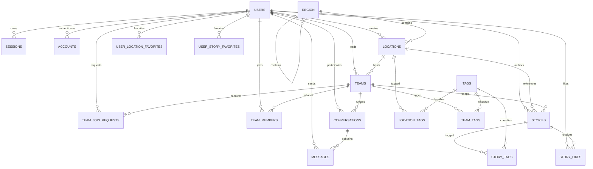

# GoMate D1 V2 数据库结构

> 2026-08-16 仓库快照。产品决策以 `docs/database-design-v2.md` 为准；可执行事实以
> `api/db/migrations/0000_init.sql` 与 `api/src/db/schema.ts` 为准。

## 基线

- Cloudflare D1 / SQLite，binding 名为 `DB`，新数据库名为 `gomate-db-v2`。
- 1 个可重放 baseline、1 条 Drizzle journal、1 份 snapshot。
- 19 张业务表、42 个索引、8 个业务触发器。
- `api/db/seed.sql` 只提供最小 Region、地点和标签，不创建用户。
- 时间统一存 Unix 毫秒；HTTP DTO 统一输出 ISO 8601。
- JSON 列在 D1 中为 TEXT，并用 `json_valid` 与 `json_type` CHECK；Drizzle 使用
  `mode: "json"`，业务代码传对象/数组。

## 关系

## 表目录

| 领域      | 表                        | 关键合同                                                                               |
| --------- | ------------------------- | -------------------------------------------------------------------------------------- |
| Auth      | `users`                   | email 唯一；profile 扩展集中在 JSON object `extra`；软删除                             |
| Auth      | `sessions`                | token 唯一；用户删除级联；用户停用或软删除时立即清空；按过期时间索引                   |
| Auth      | `accounts`                | `(provider_id, account_id)` 唯一；用户删除级联                                         |
| Auth      | `verifications`           | identifier 唯一；按过期时间清理                                                        |
| Geography | `region`                  | 自引用层级；国家内 slug/code 唯一；仅完整 city 可启用服务                              |
| Geography | `locations`               | Region 内 slug 唯一；活动类型/images 为数组，extra 为对象；发布状态受 CHECK            |
| Taxonomy  | `tags`                    | slug 唯一，不再用多态关系表                                                            |
| Team      | `teams`                   | leader/location FK；单一活动类型；开始/结束时间；人数上限；requirements/checklist JSON |
| Team      | `team_join_requests`      | 同一用户/队伍最多一个 pending；保留决定人和决定时间                                    |
| Team      | `team_members`            | `(team_id,user_id)` 复合 PK；`left_at IS NULL` 表示 active                             |
| Content   | `stories`                 | author 必填，team/location 可选；images 数组；like_count 由触发器维护                  |
| Join      | `location_tags`           | `(location_id,tag_id)` 复合 PK 与双向 FK                                               |
| Join      | `team_tags`               | `(team_id,tag_id)` 复合 PK 与双向 FK                                                   |
| Join      | `story_tags`              | `(story_id,tag_id)` 复合 PK 与双向 FK                                                  |
| Social    | `story_likes`             | `(story_id,user_id)` 复合 PK；删除任一侧级联                                           |
| Social    | `user_location_favorites` | `(user_id,location_id)` 复合 PK；专用 FK                                               |
| Social    | `user_story_favorites`    | `(user_id,story_id)` 复合 PK；专用 FK                                                  |
| Messaging | `conversations`           | `(team_id,member_user_id)` 唯一；leader/member 均为用户 FK                             |
| Messaging | `messages`                | conversation/sender FK；`(conversation_id,created_at,id)` 稳定游标                     |

## 八个触发器

1. `sessions_active_user_insert_guard`：同一 INSERT 内拒绝为非 active 或已软删除用户创建会话。
2. `users_auth_revoke_after_inactive`：用户变为非 active 或被软删除时立即撤销其全部会话与未消费的密码重置 challenge；恢复用户不会恢复旧能力。
3. `team_members_capacity_validate_insert`：新增 active 成员前验证容量。
4. `team_members_capacity_validate_reactivate`：重新激活成员前验证容量。
5. `teams_capacity_validate_update`：缩小人数上限时不得低于 active 人数。
6. `story_likes_count_after_insert`：成功点赞后增加 `stories.like_count`。
7. `story_likes_count_after_delete`：取消点赞后安全减少计数。
8. `messages_summary_after_insert`：写消息后更新会话最后消息摘要与时间。

容量仍由应用的 D1 `batch()` 提供跨语句原子性；触发器是数据库最终护栏。

## 删除策略

- Auth 子表、Team 成员/请求、标签连接、点赞和收藏随父记录级联。
- Region 与被 Team 引用的地点使用 RESTRICT，避免静默破坏业务历史。
- Story 的可选 team/location 引用删除时置空，保留内容。
- 用户相关历史中需要保留的 creator/decision 引用使用 SET NULL；身份凭证使用
  CASCADE。

## 验证

`pnpm --filter @gomate/api check:migrations` 会验证 baseline、journal、snapshot、
19 表与 8 trigger 一致。API 测试还覆盖结构/CHECK/FK/query plan、双隔离 D1 重放、
ledger 幂等和 Team 容量竞争。
