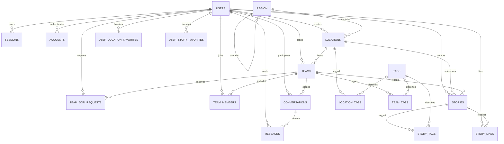

# GoMate 数据库

本文记录当前 D1 模型的领域边界、关系和必须长期保持的约束。可执行事实的优先级为：

1. [`api/src/db/schema.ts`](../api/src/db/schema.ts)
2. [`api/db/migrations/`](../api/db/migrations/)
3. migration journal、snapshot 与数据库合同测试
4. 本文

不要把本文当作 DDL 来源，也不要在文档中复制完整字段清单。

## 基线与约定

- Cloudflare D1 / SQLite，binding 为 `DB`，数据库为 `gomate-db-v2`。
- 当前 migration 链包含 `0000_init.sql` baseline 与 2 个后续 migration，共 3 条 journal entry
  和 3 份 snapshot。
- 当前 schema 包含 19 张业务表和 13 个触发器；CI 会校验 schema、migration 链与 snapshot 一致。
- 时间在 D1 中存 Unix 毫秒，HTTP DTO 输出 ISO 8601。
- JSON 列使用 Drizzle `mode: "json"`，D1 通过 `json_valid` 与 `json_type` CHECK 约束形状；业务层只传对象或数组。
- `api/db/seed.sql` 仅用于本地开发和测试，不得应用到生产。
- 所有 DDL 只通过 migration；已应用 migration 不可改写。

## 领域表

| 领域 | 表                                                 | 核心职责                                |
| ---- | -------------------------------------------------- | --------------------------------------- |
| 认证 | `users`, `sessions`, `accounts`, `verifications`   | 用户、凭据、会话与一次性 challenge      |
| 地理 | `region`, `locations`                              | Region 层级、地点内容与支持的活动类型   |
| 标签 | `tags`, `location_tags`, `team_tags`, `story_tags` | 共享标签词典与明确的资源关联            |
| 组队 | `teams`, `team_join_requests`, `team_members`      | Team 生命周期、申请和 active membership |
| 内容 | `stories`, `story_likes`                           | 普通 Story、队伍回顾与点赞计数          |
| 收藏 | `user_location_favorites`, `user_story_favorites`  | 资源专用收藏关系                        |
| 消息 | `conversations`, `messages`                        | Team leader 与单个 member 的双人会话    |

## 关系



Mermaid 只展示主要关系。可空 FK、删除动作、部分唯一索引和 CHECK 必须以 schema 与 migration 为准。

## 关键模型决策

### Region 与地点

- `region` 是自引用层级；只有字段完整的 city Region 可以启用服务。
- Location 必须属于 Region，slug 只在 Region 内唯一；公开路由使用全局 Location ID。
- Location 保存可支持的 `supported_activity_types`；Team 必须显式选择其中一种 `activity_type`。
- 地点图片与活动扩展保存在有形状约束的 JSON 中；创建者引用允许 `SET NULL`，业务内容仍保留。

### Team 生命周期与成员

- Team 持久化招募状态、成团时间和取消时间；“未开始 / 进行中 / 已完成”等展示状态由时间与这些字段派生，不由定时任务回写。
- leader 不写入 `team_members`，`max_participants` 只限制 active member。
- join request 是申请历史，`team_members.left_at IS NULL` 才表示当前成员。
- 同一用户对同一 Team 最多存在一个 pending 申请；批准申请时必须在最终写入中复核 leader、申请状态和剩余名额。
- 行动本是 Team 上的有界 JSON；API 使用内容 CAS 处理覆盖、认领和取消认领冲突。

### Story、收藏与消息

- 普通 Story 与 Team 回顾使用同一张表；回顾可引用 Team，Location 可由 Team 推导。
- `like_count` 是由触发器维护的派生计数；收藏使用两个资源专用连接表，不使用多态外键。
- 每个会话由 `(team_id, member_user_id)` 唯一确定，访问者必须是该 member 或 Team 当前 leader。
- `messages.read_at` 同时表达已读状态和时间；消息与会话列表使用稳定复合 cursor。

### 认证与隐私

- session 真相只在 D1 `sessions`；KV 不是 session 或权限来源。
- 用户变为非 active 或软删除时，同一数据库更新会撤销其 session 和未消费的密码重置 challenge。
- 新建 session、签发 challenge 和消费 challenge 都在最终写语句复核用户仍 active 且未删除。
- 用户可扩展资料保存在 `users.extra`；敏感字段的读取仍由 API 权限决定。
- 账户删除使用匿名墓碑保留历史外键，同时清除 PII、凭据、session、关联 challenge 和自有头像。

## 数据库护栏

当前 13 个触发器：

1. `sessions_active_user_insert_guard`：拒绝为非 active 或已删除用户创建 session。
2. `users_auth_revoke_after_inactive`：用户停用或软删除时撤销认证状态。
3. `users_deleted_state_validate_insert`、`users_deleted_state_validate_update`：强制
   `status = deleted` 与 `deleted_at` 同时成立。
4. `team_members_capacity_validate_insert`、`team_members_capacity_validate_reactivate`：
   新增或重新激活 active member 前验证容量。
5. `team_members_leader_validate_insert`、`team_members_leader_validate_reactivate`：禁止 leader
   成为 active member。
6. `teams_capacity_validate_update`：人数上限不得低于 active member 数量。
7. `teams_leader_validate_update`：禁止把 active member 直接设为 leader。
8. `story_likes_count_after_insert`、`story_likes_count_after_delete`：原子维护 Story 点赞计数。
9. `messages_summary_after_insert`：更新会话最后消息摘要与时间。

触发器只承担数据库最终护栏。跨语句原子写仍使用 D1 `batch()` 与条件 DML；禁止
`db.transaction()` 或裸 `BEGIN` / `COMMIT`。

## 删除与存储边界

- 凭据、session、成员/申请、标签连接、点赞和收藏按父记录级联。
- Region 和被 Team 引用的 Location 使用 RESTRICT，避免破坏业务历史。
- Story 的 Team 回顾引用使用 RESTRICT，Location 引用删除时置空；需要保留历史的
  creator/decision 引用使用 SET NULL。
- 账户删除保留匿名用户墓碑与历史 Team、Story、Conversation、Message 引用，不物理删除用户行。
- R2 保存媒体对象；D1 保存所有权和业务引用。媒体写入采用临时对象、最终对象、条件 DML 与补偿清理。
- `CACHE_KV` 只用于公共缓存和限流纵深，不保存原始 PII，也不承担权限或精确计数真相。

## 迁移与验证

新增 migration 时必须同步更新 Drizzle schema、journal 和 snapshot，并运行：

```bash
pnpm --filter @gomate/api check:migrations
pnpm --filter @gomate/api test
```

生产 migration、恢复和 rollback 还必须遵守 [`prod-change-policy.md`](prod-change-policy.md)。
