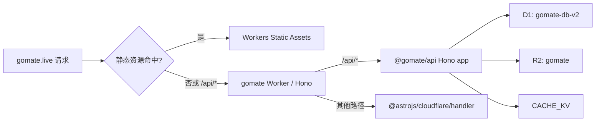

# GoMate 单 Worker 与数据库 V2 彻底重构设计

状态：V3 已批准，进入实施  
日期：2026-08-16  
目标分支：`codex/unify-worker-db-v2`

## 1. 结论

本次采用一次性切换，不建立兼容层：

- `gomate.live` 由一个 Cloudflare Worker 同时承载 Astro SSR、静态资源和 Hono API。
- 所有业务 API 统一位于 `/api/*`；`api.gomate.live` 和旧根路径 API 不保留兼容。
- D1 以 `docs/database-design-v2.md` 为唯一目标结构，从零建立单一 `0000_init.sql`。
- 删除 MCP 包、公开 `/v1` API、API Key 能力、相关 UI、依赖、测试、字段和表。
- 删除旧 D1 修补迁移，不迁移旧数据，不双写，不运行旧队伍状态 cron。
- 本 PR 只完成代码、迁移、验证和部署编排，不修改远程 D1、不部署生产。

当前没有真实用户，因此上述破坏性边界是有意设计，而不是遗漏。

## 2. 设计来源与优先级

冲突时按以下优先级处理：

1. `docs/database-design-v2.md`
2. 本设计中明确的运行时和交付决策
3. 现有产品行为中仍被前端使用的能力
4. 旧 API、旧 schema 和历史迁移

平台依据：

- Cloudflare 推荐用 Workers Static Assets 承载全栈应用：<https://developers.cloudflare.com/workers/best-practices/workers-best-practices/>
- 静态资源默认 asset-first，可对 `/api/*` 使用选择性 worker-first：<https://developers.cloudflare.com/workers/static-assets/routing/worker-script/>
- Astro 6 自定义 Worker 入口通过 `@astrojs/cloudflare/handler` 委派 Astro 请求：<https://docs.astro.build/en/guides/integrations-guide/cloudflare/#changed-custom-entrypoint-api>
- D1 迁移以顺序 SQL 文件管理：<https://developers.cloudflare.com/d1/reference/migrations/>

## 3. 范围

### 3.1 必须完成

- 单 Worker 入口、单 Wrangler 配置、单本地开发服务器、单部署流程。
- 19 张 V2 表、全部声明式约束、索引和 6 个触发器。
- 现有前后端业务代码全部切换到 V2 字段、关系和状态模型。
- 旧 Activity Post 合并为带 `team_id` 的 Story。
- `cities` 切换为 `region`，用户资料城市切换到 `users.extra.city`。
- 成员申请拆为 `team_join_requests`，正式成员只进入 `team_members`。
- 收藏与标签关系拆为专用关联表。
- 图片缓存移出 D1；Better Auth session/verification 只写 D1，KV 只保存可重建业务缓存。
- 删除 MCP、`/v1`、API Key 和所有孤儿引用。
- 更新 API、数据库、页面、开发、部署和生产变更文档。
- 完成本地迁移重放、数据库不变量、API/前端/E2E、Worker dry-run 与包体检查。

### 3.2 明确不做

- 不迁移、备份或回填当前远程 D1 数据。
- 不保留 `api.gomate.live` 代理、跳转或 CORS 兼容。
- 不创建或修改 Cloudflare 远程资源，不切换生产域名。
- 不新增 MCP 替代品、公开开发者 API 或 API Key 管理能力。
- 不为旧字段、旧状态、旧分页参数或旧响应形状增加适配层。

## 4. 能力地图与依赖

| 能力                     | 稳定边界                                                | 依赖           | 独立验收                              |
| ------------------------ | ------------------------------------------------------- | -------------- | ------------------------------------- |
| `database-v2`            | Drizzle schema、`0000_init.sql`、seed、DB 不变量        | 无             | 全新库重放、19 表、6 触发器、FK check |
| `mcp-api-removal`        | MCP 包、`/v1`、API Key 服务/UI/依赖                     | 无             | 全仓零可执行引用、旧端点 404          |
| `application-adaptation` | Region、Location、Team、Story、Favorites、Messages 服务 | `database-v2`  | API 集成测试和前端契约测试            |
| `single-worker-runtime`  | Hono API + Astro SSR + Assets + bindings                | API app 可导入 | 单端口 smoke、路由隔离、dry-run       |
| `delivery-pipeline`      | 本地脚本、CI、手动首发、回滚                            | 前四项         | PR checks 全绿且不触发生产变更        |

推荐实施顺序：先锁定 schema 与 API app 边界；数据库和 MCP 删除并行；再适配业务；最后接入单 Worker 与交付流程。

## 5. 目标运行时架构

### 5.1 包边界

- 保留 `api/` 和包名 `@gomate/api`，但它不再是可独立部署的 Worker。
- 新增 `api/src/app.ts`，导出不含部署前缀的 route-relative Hono `apiApp` 和必要类型；唯一 Worker 在挂载时增加 `/api`。
- 删除 `api/src/index.ts` 的部署入口语义、`api/wrangler.toml` 和 `deploy/dev` 独立脚本。
- `frontend/` 成为唯一 Worker 应用；新增 `frontend/src/worker.ts`。
- `api/package.json` 明确导出 `./app` 源码入口；`frontend/package.json` 明确声明 `@gomate/api` workspace 依赖和直接使用的 `hono` 依赖。
- 不把后端代码复制到前端目录，也不把 Astro 页面塞入 API 包。

### 5.2 请求管线

`frontend/src/worker.ts` 是标准 Cloudflare Worker export，并使用一个外层 Hono 实例：

1. 挂载 `apiApp` 的 `/api` routes。
2. 紧接着为 `/api` 和 `/api/*` 注册显式 JSON 404；不能依赖子 Hono 的 `notFound`，因为 `route()` 不复制它。
3. 所有其余请求调用 `handle(request, env, ctx)`，由 `@astrojs/cloudflare/handler` 执行完整 Astro pipeline。

不在原始 Wrangler 入口直接组合 `astro/hono`。当前 Astro 6.4.6 的 `FetchState` 要求 Request 已附着 Astro app，且官方自定义 Worker 入口就是 `@astrojs/cloudflare/handler`。API 404 测试必须同时断言 404、`application/json` 和稳定错误 envelope。

### 5.3 URL 与认证

- 对外 API 根路径固定为同源 `/api`。
- Better Auth 从 `/auth` 改为 `/api/auth`。
- 浏览器 API 客户端固定 base `/api`；所有 helper 调用方只能传不含 `/api` 的资源路径（如 `/teams`），禁止保留剥离前缀的 normalize 兼容层。
- Astro SSR 不做 HTTP self-fetch。新增 server-only dispatcher，用 `cloudflare:workers` 的 `env`、当前 Request/Cookie 和 `Astro.locals.cfContext` 在进程内调用 `apiApp.fetch`；sitemap、页面 frontmatter 与 SSR helper 全部走该入口。
- raw `fetch`、E2E fixture 和浏览器 helper 也遵守同一资源路径约定；静态检查拒绝 `/api/api/`、`PUBLIC_API_URL` 和硬编码 API origin。
- 生产 cookie 使用 `Secure + SameSite=Lax + Path=/`，不再启用跨子域 cookie。
- 删除全局跨域 CORS 中间件和 `FRONTEND_URL`、`CORS_ALLOWED_ORIGINS`、`BETTER_AUTH_URL` 配置。
- `APP_URL` 仅作为邮件链接等无法从当前请求推导的 canonical origin；本地值与单一 dev 端口一致。
- 每个部署环境必须配置精确的 `APP_URL` 和 Better Auth `trustedOrigins=[APP_URL]`。preview 使用固定、显式列出的 `gomate-production-preview.<account-subdomain>.workers.dev` origin；禁止 `*.workers.dev` 通配信任。
- Better Auth 删除 `secondaryStorage`；`sessions` 和 `verifications` 只以 D1 为权威存储。

生产首发支持 `WRITE_MODE=protected|open`。API 顶层中间件在 `protected` 时拒绝除 `GET/HEAD/OPTIONS` 之外的全部 `/api/*` 请求，包括 Better Auth 登录、注册、退出及所有业务 mutation，返回 `503`、稳定错误码 `WRITE_PROTECTED` 和 `Retry-After`；health/read/session-read 仍可用。该模式没有隐藏绕过 token，完整 auth/write smoke 只能在精确 origin 的 preview 或解除保护后执行。

### 5.4 静态资源和包体

- Wrangler 使用 `assets.directory = './dist'` 和 `ASSETS` binding。
- 仅 `/api`、`/api/*` 配置 worker-first；哈希资源保持 asset-first。
- 删除 `@resvg/resvg-wasm`、仓库内 `resvg.wasm` 及 PNG 假设；分享海报、预览、下载和 share file 全部切为 `image/svg+xml`/`.svg`。
- dry-run gzip 目标不超过 2.4 MiB，硬门槛不超过 3 MiB；CI 记录实际值。
- CI 同时运行 `wrangler check startup`；若保留 Smart Placement，必须用本地/预览延迟证据证明不会拖慢静态资源和 SSR。

### 5.5 Cloudflare bindings

唯一配置位于 `frontend/wrangler.jsonc`：

| Binding    | 用途                                                 |
| ---------- | ---------------------------------------------------- |
| `DB`       | 新的 `gomate-db-v2`，迁移目录 `../api/db/migrations` |
| `R2`       | 长期图片对象                                         |
| `CACHE_KV` | 分享海报、首页等可重建且有 TTL 的业务缓存            |
| `ASSETS`   | Astro 构建后的静态资源                               |

Astro 自身 session 当前完全未使用；在 Astro config 中显式使用 `sessionDrivers.lruCache({ max: 1 })` 以阻止 adapter 自动创建 session KV，并用静态检查禁止新增 `Astro.session`。Better Auth 不使用 KV。Wrangler types 是 `Env` 的唯一生成来源，不再手写会漂移的 binding 类型。

Astro adapter 的 `persistState.path` 读取 `GOMATE_LOCAL_STATE`（默认 `~/.gomate/wrangler-state`），保留多 worktree 共享本地 D1。唯一配置不含 cron；队伍生命周期在读取时由 `start_at/end_at/formed_at/cancelled_at` 计算。

## 6. 数据库 V2

### 6.1 最终表清单

必须且只能存在以下 19 张业务表：

1. `users`
2. `sessions`
3. `accounts`
4. `verifications`
5. `region`
6. `locations`
7. `tags`
8. `location_tags`
9. `teams`
10. `team_tags`
11. `team_join_requests`
12. `team_members`
13. `stories`
14. `story_tags`
15. `story_likes`
16. `user_location_favorites`
17. `user_story_favorites`
18. `conversations`
19. `messages`

`sqlite_*`、`d1_migrations` 不计入业务表。

字段、FK 动作、CHECK、索引和 JSON 约束逐项以 `docs/database-design-v2.md` 为准，不在实现中另创兼容字段。

### 6.2 迁移策略

- 删除 `api/db/migrations/` 下全部历史 SQL 和旧 Drizzle meta。
- 新建唯一 `api/db/migrations/0000_init.sql`。
- baseline 明确创建 19 表、索引、部分唯一索引和 6 触发器。
- 所有 table/index/trigger 使用幂等 DDL；同一 DB 连续执行 baseline 两次必须成功，另在两个隔离的 workerd/D1 状态目录各通过 Wrangler migration ledger 应用一次。
- test helper 直接加载 baseline，不再维护第三份手写 DDL。
- 结构清单逐项核对：19 表、所有列的 type/null/default/PK、FK action、CHECK、索引列序/唯一性/partial WHERE，并拒绝任何非目标触发器。
- `_journal.json` 只能有 `idx=0/tag=0000_init`；SQL、journal 与唯一 snapshot 一一对应。
- `api/src/db/schema.ts` 与 baseline 由完整同步测试校验，不允许只改一边。

### 6.3 时间、JSON、布尔和 ID

- ID 均为应用生成的 TEXT PK。
- DB 时间默认严格使用目标文档的 `(unixepoch() * 1000)`；测试直接执行未提供时间字段的 INSERT 并断言整数毫秒默认。
- 所有布尔列为 INTEGER，默认明确且 CHECK `IN (0, 1)`。
- JSON array/object 列同时检查 `json_valid` 与 `json_type`。
- API 写入前再用 Zod 校验元素类型、枚举、去重、URL 域名和业务关系。

### 6.4 六个触发器

- `team_members_capacity_validate_insert`
- `team_members_capacity_validate_reactivate`
- `teams_capacity_validate_update`
- `story_likes_count_after_insert`
- `story_likes_count_after_delete`
- `messages_summary_after_insert`

触发器以 `RAISE(ABORT, stable_error_code)` 返回稳定错误码，服务层集中映射而不是向客户端泄漏 SQL。具体合同为：容量触发器返回 `TEAM_CAPACITY_EXCEEDED`（409），Story 计数触发器失败返回 `STORY_LIKE_COUNT_FAILED`（409），消息摘要触发器失败返回 `MESSAGE_SUMMARY_FAILED`（409）；未知 D1/SQLite 文本一律映射为通用 `DATABASE_CONSTRAINT_FAILED`（422）且原始 SQL 只进入脱敏服务端日志。每个码都有 API envelope 与原始 SQL 不泄漏测试。

### 6.5 Seed

seed 与 migration 分离。最小 seed 必须包含：

- 中国根/广东省/深圳市 Region 层级，其中深圳为开放城市且含时区和中心坐标。
- 至少一个已发布地点，支持一个或多个合法 activity type。
- 至少三个共享标签。

seed 使用 `INSERT OR IGNORE` 并可重复执行。E2E/QA seed 另行创建用户、账号、队伍、申请、成员、Story、收藏和消息，全部使用 V2 关系。

### 6.6 跨表命令与原子性

`db.transaction()` 在项目中被禁止；所有多步原子写入只能使用 D1 `db.batch([...])`。不变量的唯一执行方式如下：

| 不变量                                                | 执行方式                                                                                             | 必测失败面                                  |
| ----------------------------------------------------- | ---------------------------------------------------------------------------------------------------- | ------------------------------------------- |
| Location 与 `users.extra.city` 只引用开放 city Region | 写入前查询 + 条件 DML                                                                                | district、未开放、失效 Region               |
| Region 同国家且无循环                                 | parent 校验 + recursive CTE 后条件更新                                                               | 跨国 parent、自引用、祖先循环               |
| Team activity 属于 Location 支持列表                  | `INSERT/UPDATE ... SELECT` 条件 DML                                                                  | 不支持类型、并发修改地点                    |
| Location 不移除未来有效 Team 使用类型                 | 检查 future uncancelled teams 后条件更新                                                             | 并发删支持类型                              |
| leader 不进入 `team_members`                          | service auth + 条件 DML                                                                              | leader join/approve                         |
| approve 同时激活成员并决策申请                        | 仅 `db.batch`；member insert/reactivate 依赖 pending request，随后条件 update request；检查 changes  | 满员回滚、过期重试、并发争最后名额          |
| Team recap 作者/时间/location 合法                    | `INSERT ... SELECT` 联结 team/member 条件                                                            | 未成行、未结束、已取消、非成员、错 location |
| Conversation/message 参与者合法                       | 条件 DML 联结当前 leader 与 active member                                                            | 退队成员、旧 leader、第三人发送             |
| R2/D1 一致性                                          | temp upload → copy 到 final key → D1 batch → 删除 temp；D1 失败用 `waitUntil` 删除 final/temp orphan | 上传失败、copy 失败、D1 失败、清理重试      |

批准申请必须有真实 workerd/D1 测试，而不只依赖 better-sqlite3 shim：成功批准、满员整批回滚、同请求重试、两个申请并发争最后一个名额。batch 任一 SQL 报错必须证明整批回滚。

## 7. 业务适配契约

### 7.1 Region 和用户资料

- 删除 `/api/cities`，新增 `/api/regions`；城市选择查询 `level=city&serviceEnabled=true`。
- 用户 API 将 `extra` 解析为版本化 `UserExtra`，对外返回 `level/completedHikes/wechat/city` 的产品字段时由服务层显式投影；数据库不恢复独立列。
- 修改用户资料使用 JSON merge，并在写 city 时校验目标 Region 为开放城市。
- Team/Location list filter、recommend-onboarding 的请求和响应统一从 `cityId` 改为 `regionId`。改造闭包至少包含 `api/src/services/recommend-onboarding.ts`、`api/src/routes/teams/recommend-onboarding.ts`、teams/locations list query、`frontend/src/pages/{teams,locations}/index.astro`、locations/teams hooks、profile/onboarding/location form 的 Region selector，以及 `packages/lib`/共享类型中的 geo helpers。
- `users.extra.city` 是保留的产品字段，但值必须是开放 city Region ID，不是城市名称或旧 City ID。静态门禁拒绝可执行代码中的 `cities` 表、`locations.cityId`、旧 `City` 数据形状和 Team/Location query 的 `cityId`。

### 7.2 Location

- 输入输出使用 `regionId`、`supportedActivityTypes`、`coverImageUrl`、经纬度和结构化 `extra`。
- 删除旧 `type/cityId/cityName/coordinates/coverImage` 以及扁平徒步、停车和 API Key actor 字段。
- 标签只经 `location_tags` 管理。
- stats 成为内部 `/api/locations/stats`，替代被删除的 `/v1/locations/stats`。

### 7.3 Team

- 输入输出切换为 `activityType/startAt/endAt/maxParticipants/recruitmentStatus/formedAt/cancelledAt`。
- API 统一用一个纯函数计算 lifecycle：`cancelled/pending/formed/in_progress/completed/expired_unformed`。
- `join` 新建 `team_join_requests`；审批资源使用申请 ID，例如 `/teams/:teamId/join-requests/:requestId/approve`。
- `approve` 只使用 `db.batch` 决策申请并 insert/reactivate 成员；队长从不创建成员行。
- `leave/remove` 只写 `left_at`，不物理删除历史；再批准时清空 `left_at` 并刷新 `joined_at`。
- 删除旧 `leave-request/approve-leave/reject-leave` 工作流。`reject` 与用户取消申请只更新申请；用户取消写 `decided_at` 且 `decided_by_user_id=NULL`。
- `pending` 的两个 decision 字段全空；`approved/rejected` 两者全非空；`cancelled` 要求 `decided_at` 非空且决定人可空。
- `form/cancel` 只写 `formed_at/cancelled_at/recruitment_status`，不回写派生 lifecycle。
- 容量不含队长，不写入 `full/completed` 等派生状态。
- tags 只经 `team_tags` 管理。
- 删除 scheduled export、admin 手工 cron route、`updateExpiredTeams`、读取时写状态的 query-time mutation、`api/src/lib/team-status.ts` 及旧状态持久化测试；静态门禁拒绝 `updateExpiredTeams` 和任何派生 lifecycle 回写。

### 7.4 Story 和旧 Activity Post

- 删除 `activity-posts` 路由、表、类型和独立前端模型。
- 队伍回顾通过 `/api/stories` 创建，携带 `teamId`；地点详情和队伍详情以 Story feed 展示。
- 旧 `upload/activity-post` 改为 Story 图片上传；删除 `frontend/src/components/features/activity-posts/**` 并把详情页入口替换为 Story recap 组件。
- 普通 Story 与队伍回顾共用 `stories`、`story_tags`、`story_likes`。
- 点赞只增删 `story_likes`，计数只由触发器维护。

### 7.5 Favorites

- 删除多态 `user_favorites`。
- API 改为 `/api/favorites/locations` 与 `/api/favorites/stories`，分别操作专用表。
- 前端收藏页合并两个查询结果，但写操作必须走明确资源路径。

### 7.6 Messages

- 会话以 `(team_id, member_user_id)` 唯一；leader 从 team 实时读取。
- 删除 `leader_id/user_id/is_read` 旧语义，使用 `memberUserId/initiatedByUserId/readAt`。
- 只有队员本人或当前 leader 能创建会话、发送、读取和标记消息。
- message cursor 是 opaque base64url JSON `{ "t": timestampMs, "id": string }`。旧 `since` 删除；按倒序取历史时使用 `created_at < t OR (created_at = t AND id < idCursor)`，返回前为 UI 正序，`nextCursor` 指向本页最旧项。

### 7.7 缓存、分享与本地圈

- 删除 `image_caches`，海报/远端图片缓存写入 `CACHE_KV` 并设置 TTL。
- 删除 `share_events`、`/api/shares/track`、Story share stats、admin share analytics 和前端 `trackShare`；保留原生分享但不再埋点。
- local-circle 请求/响应统一使用 `regionId/regionName`；CF-IPCity 先按开放 Region 的 `name/name_en` 解析，失败回退 seed 中稳定的深圳 Region ID。
- KV 只缓存不含用户信息的公共聚合（如 `activePeopleCount/topLocations`），key 固定为 `local-circle:v2:public:<regionId>:<language>`；`neighborTeams` 每次按当前 `currentUserId` 从 D1 计算并在响应阶段合并，绝不写入公共 KV。测试必须证明匿名、用户 A、用户 B 的个性化结果互不命中/泄漏。
- local-circle SQL 切到 `region`、V2 teams、active team members、已发布 Team recap Story 和专用收藏表。
- 缓存不可成为权限或业务真相来源；KV 失败时回源 D1 或继续生成。

## 8. MCP 与 API Key 删除清单

必须删除：

- 整个 `packages/mcp/` workspace。
- `api/src/routes/v1/`、`app.route('/v1', ...)`、OpenAPI 文件和 v1 E2E。
- `@better-auth/api-key` 前后端依赖、Better Auth 插件和 schema mapping。
- 自定义 API Key create/list/revoke 路由、API Key 鉴权、actor audit、idempotency 中仅服务 v1 的代码。
- `apikey` 表、全部 `actor_api_key_id` 字段和索引。
- API Key 设置页面、组件、导航入口、i18n key 和相关测试。
- 文档中把 MCP/API Key 描述为现行能力的内容。
- 重建 `pnpm-lock.yaml`，并更新 `packages/types`、`packages/lib` 与前端本地 types 中的 City、旧 Team、旧 Message、API Key 合同。

允许保留的唯一文本是数据库设计/迁移决策中说明“已删除”的历史记录。

静态删除门禁精确扫描 `@better-auth/api-key`、`apikey`、`actor_api_key`、`x-api-key`、`settings/api-keys`、`/api-key`、`apiKeyClient`、`gm_live_`、`packages/mcp`、`routes/v1`；不使用会误伤第三方邮件/地图 secret 的泛化 `API_KEY` 模式。

## 9. 本地开发与 CI/CD

### 9.1 本地开发

- `pnpm dev` 与 `pnpm dev:wt` 只启动一次 Astro/workerd，默认端口 5432。
- 删除 `GOMATE_API_PORT`、前端 `.env.local` 的 `PUBLIC_API_URL` 生成和双进程 `concurrently`。
- `.dev.vars` 移到唯一 Worker 目录 `frontend/.dev.vars`；初始化脚本只补这一份。
- `pnpm db:reset` 只删除经过解析和校验的本地 D1 状态目标，然后从 `0000_init.sql` 重建并 seed。
- 不再从 prod 同步旧地点数据；`db:sync` 删除。
- 同步重写 `env-check`、`promote-admin`、migration drift、init/start-worktree、E2E health、Playwright fixtures/config、Lighthouse、PR template；不得保留旧 `api/` Wrangler cwd、8799 端口或 `gomate-db`。

### 9.2 PR validation

一个 PR workflow 覆盖：

1. install + i18n build/validate
2. API lint/type-check/test
3. 前端 lint/type-check/test/build
4. migration sync、fresh replay、schema/trigger/FK/query-plan tests
5. 单 Worker dry-run、startup check、gzip 包体门槛和 Wrangler 生成类型漂移检查
6. 单服务器 Playwright E2E

Lighthouse 作为上述唯一 PR validation workflow 的一个 job 运行，不保留第二个独立 PR workflow；统一 production deploy workflow 仍只允许手动触发。

### 9.3 生产部署

本 PR 必须删除 `.github/workflows/api-deploy.yml` 和 `frontend-deploy.yml`，避免 main push 对旧 `gomate-db` 应用新 baseline。新统一部署 workflow 只允许 `workflow_dispatch`，绑定受保护的 `production` environment，并在真实 IDs 未配置时 fail closed；本次 PR 不触发它。

远程交付采用两个 PR：

1. 本重构 PR：提交 ID-free 的本地/预览 binding 声明、完整代码和手动部署 workflow；旧生产继续运行。
2. 在另行获批后以显式 `--binding DB/CACHE_KV --env production --update-config` 创建 `gomate-db-v2` 与 `CACHE_KV` 并获得真实 `database_id`/namespace ID；再提交一个只包含真实 binding IDs 和 secrets/origin checklist 的部署配置 PR。该 PR 合并不会自动挂载 production route。

第二个 PR 合并后的首发顺序固定为：

1. 受保护 production job 全程设置 `CLOUDFLARE_ENV=production`；执行 `pnpm --filter @gomate/frontend build`，Astro Cloudflare 环境必须在 build 时选择。
2. 仅通过 `wrangler d1 migrations apply DB --remote --env production` 应用 migration ledger，禁止 `d1 execute` 执行 DDL。
3. 以精确 preview `APP_URL/trustedOrigins` 部署不带 production route 的固定名 `gomate-production-preview`，完成静态页面、SSR、注册/登录/session/退出、业务写路径、R2/KV smoke。
4. 将 production Worker 的 `WRITE_MODE` 设为 `protected`；通过第二个受保护的人工 gate 后才使用 Wrangler `--domain gomate.live`（或等价 Cloudflare API 的精确 Custom Domain 操作）应用 production route。首次 preview deploy 绝不能附带 `--domain/--route`。
5. 切流后只执行 read smoke、session-read 和 mutation 预期 `503 WRITE_PROTECTED` 测试；观察 30 分钟静态/SSR/read 错误率与 5xx。此阶段不得把登录或成功写入作为健康指标。
6. 观察通过后将 `WRITE_MODE=open`，立即执行受控注册/登录/session/退出及关键业务写 canary，再观察 30 分钟 auth 成功率、写成功率、错误率和 5xx。
7. 至少保留旧 Worker/域名/D1 7 天；之后另行批准归档 `api.gomate.live` 和旧 Workers。

任何远程资源、secret、migration、deploy 或 route 变更都在本任务之外按 `docs/prod-change-policy.md` 先声明、获批再执行。

### 9.4 回滚

- 代码回滚：切回旧 Worker route/版本。
- 数据库回滚：切回旧 D1 binding；不对 V2 做逆向迁移。
- 旧 Worker 和旧 D1 在首发观察期内保持只读可恢复，不在本 PR 删除。
- 域名切换后的首个 30 分钟观察期保持 API 写保护，因此可无数据分叉地切回旧 route。
- 解除写保护后不再自动切回旧 D1；若发生事故，先冻结写入和保留 V2 D1，再由事故决策选择修复前滚或显式接受数据丢失。当前无用户不等于可以默默丢弃公开切流后的新写入。

## 10. 验收标准

### 10.1 静态结构

- [ ] 只有一个部署入口和一个 Wrangler 配置。
- [ ] `packages/mcp`、`routes/v1`、API Key UI/依赖均不存在。
- [ ] schema 只导出 V2 19 表。
- [ ] migrations 只有 `0000_init.sql` 和必要的新 meta。
- [ ] 全仓没有指向 `api.gomate.live`、`PUBLIC_API_URL`、独立 API 端口或旧 MCP 能力的可执行配置。
- [ ] 可执行配置中没有 `gomate-api`、`gomate-frontend`、旧 `gomate-db`、旧 Wrangler cwd；legacy deploy workflows 已删除。

### 10.2 数据库

- [ ] 同一 DB baseline 连续执行两次成功，两个隔离 workerd 状态各通过 migration ledger 应用成功。
- [ ] 精确 19 张业务表、6 个目标触发器。
- [ ] `PRAGMA foreign_key_check` 返回空。
- [ ] 11 条关键不变量均有成功、拒绝及适用的并发/故障回滚测试。
- [ ] Location 城市 feed、Team 地点/活动 feed、Story 全局/地点/队伍 feed、两个收藏列表、Conversation inbox、Message cursor 的 `EXPLAIN QUERY PLAN` 命中目标索引。

### 10.3 运行时

- [ ] `/api/health` 返回 JSON 200。
- [ ] `/health` 不再暴露旧 API；由 Astro 404 处理。
- [ ] `/api/unknown` 返回 JSON 404，不返回 HTML。
- [ ] `/`、动态 Astro 页面、静态 `_astro/*` 在同一端口可访问。
- [ ] 同源注册、登录、session、退出流程通过。
- [ ] Worker gzip 小于 3 MiB，目标小于等于 2.4 MiB。
- [ ] `wrangler check startup` 通过；SSR 内部 API dispatch 不发起同区 HTTP self-fetch。

### 10.4 产品回归

- [ ] Region/地点列表与详情。
- [ ] 创建/编辑/取消/成行队伍、申请/批准/拒绝/离开。
- [ ] 普通 Story、队伍回顾、点赞、标签。
- [ ] 地点与 Story 收藏。
- [ ] 私信创建、发送、游标分页、已读。
- [ ] R2 上传、SVG 分享海报和 KV fallback。
- [ ] 首页、本地圈、个人资料、我的队伍没有旧字段依赖。

## 11. 风险与控制

| 风险                         | 控制                                                  |
| ---------------------------- | ----------------------------------------------------- |
| 合并 bundle 超过 Worker 上限 | 删除 resvg WASM；dry-run gzip 硬门槛                  |
| Astro handler 吞掉 API 404   | API route 后显式注册 `/api` 与 `/api/*` JSON fallback |
| schema 与 SQL 漂移           | migration sync 测试 + fresh replay                    |
| 容量并发超卖                 | 三个 DB trigger + 冲突测试                            |
| 批准申请部分成功             | 仅 D1 `db.batch` + 真实 workerd 故障回滚测试          |
| JSON 数据失真                | DB json_type CHECK + Zod 元素校验                     |
| 新部署误写旧 D1              | 新 database name；禁用旧自动部署；首发人工 gate       |
| 删除 MCP 不彻底              | 代码、依赖、路由、UI、文档和全仓引用扫描              |

## 12. 安全威胁模型

| 信任边界/资产                   | 主要滥用                     | 控制与首个负向测试                                           |
| ------------------------------- | ---------------------------- | ------------------------------------------------------------ |
| Better Auth cookie / 账号与 PII | 伪造 session、跨用户读取     | D1 session、Secure/Lax/httpOnly、每个资源 ownership 测试     |
| Team/Story/Message 写 API       | IDOR、旧 leader/退队成员越权 | 条件 DML + 当前角色查询；第三人和失效成员 403                |
| 上传与 R2                       | 超大/伪装文件、孤儿对象      | MIME/大小/魔数、temp key、补偿清理故障测试                   |
| 图片代理/远端图片               | SSRF、重定向到私网           | HTTPS host allowlist、禁止 redirect、超时；私网/非白名单拒绝 |
| D1 并发写                       | 容量超卖、计数漂移、部分审批 | trigger + `db.batch` + 两请求并发测试                        |
| 错误和日志                      | SQL/secret/PII 泄漏          | 稳定错误 envelope；日志脱敏测试/审查                         |

认证端点继续使用输入长度限制和速率限制；删除 API Key/CORS 不减少任何 session、ownership 或 admin authorization 检查。依赖变更后运行 pnpm 原生 audit，并按可达性处置 critical/high。

## 13. 审查门槛

在写业务实现前，必须由三个独立审查分别给出无阻塞结论：

1. Cloudflare/Astro 单 Worker 路由、bindings、包体和部署审查。
2. D1 V2 schema、触发器、不变量、迁移与测试审查。
3. MCP/API Key 删除完整性、调用方、CI/本地开发与回滚审查。

发现阻塞问题时先修订本设计，再开始实现。
